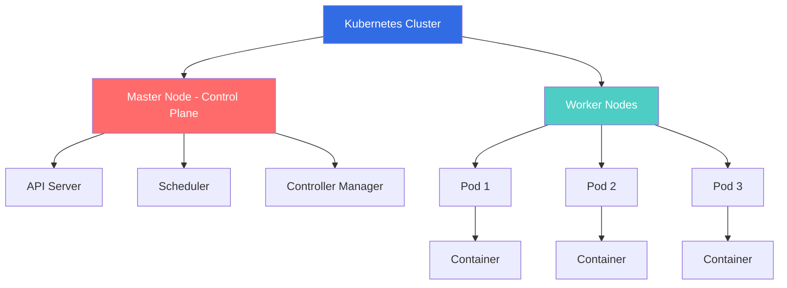
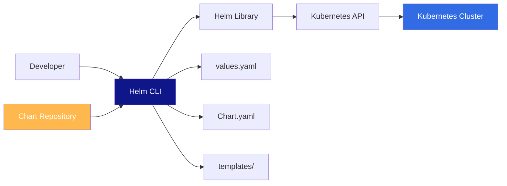
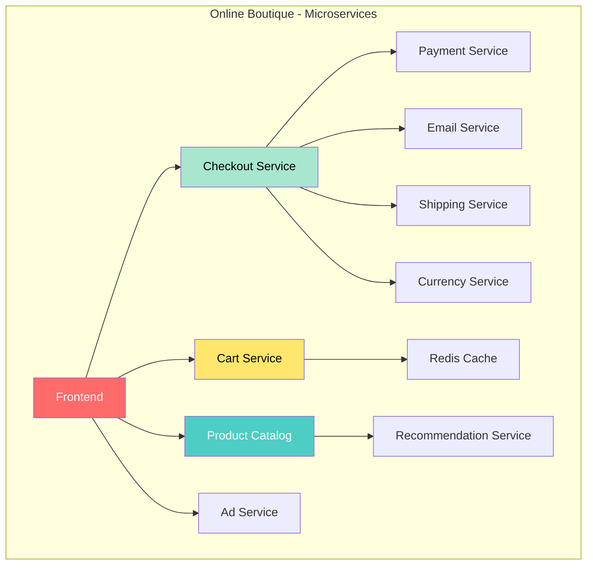
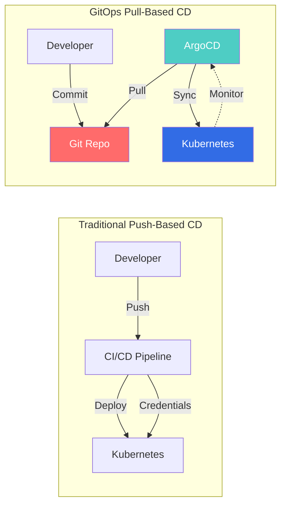
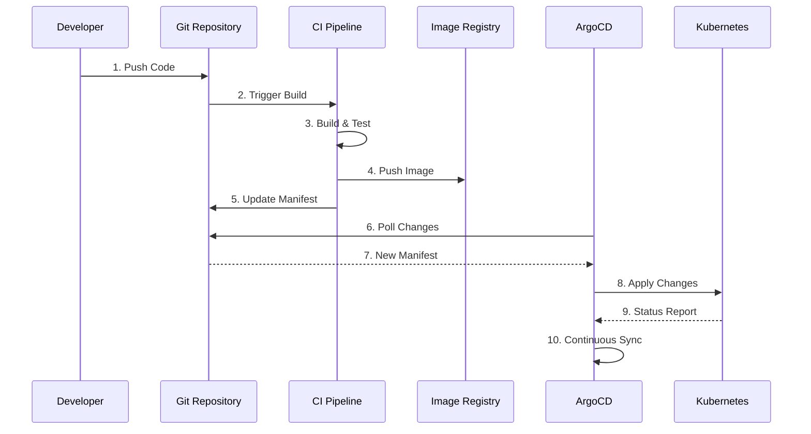
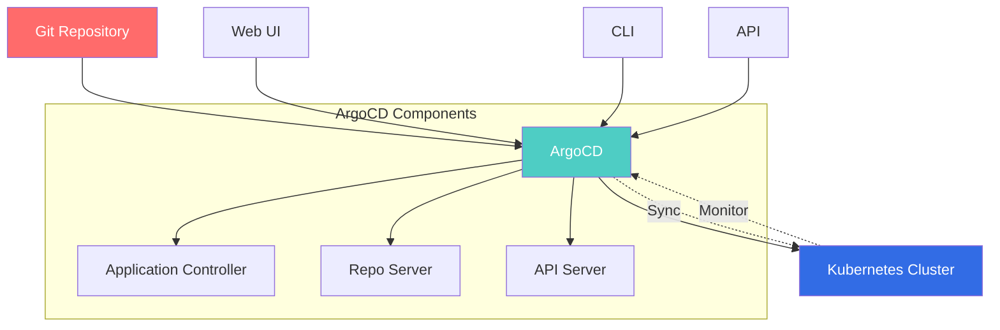
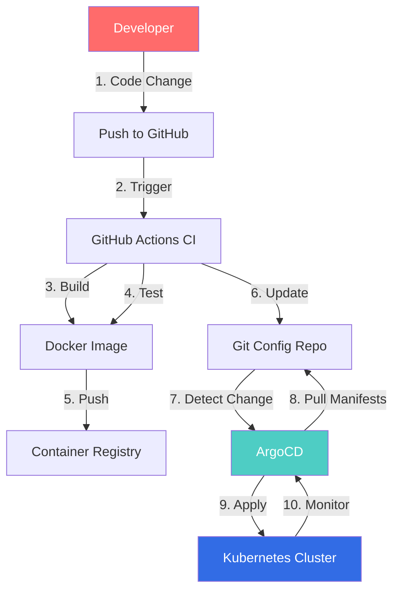

# 🚀 Helm & GitOps Configuration: Complete Beginner's Guide

> **Orchestration Made Easy with Kubernetes**

## 📚 Table of Contents
1. [Introduction to Kubernetes Package Management](#introduction)
2. [Helm Charts Fundamentals](#helm-charts)
3. [Helm for Microservices](#helm-microservices)
4. [GitOps Concepts](#gitops)
5. [ArgoCD Configuration](#argocd)
6. [Complete Workflow Example](#complete-workflow)
7. [Best Practices](#best-practices)

---

## 🎯 Introduction to Kubernetes Package Management {#introduction}

### The Problem: Managing Complex Kubernetes Applications

Imagine you're organizing a massive event. You need:
- Venue booking
- Catering
- Entertainment
- Decorations
- Security

Without a coordinator, you'd manually manage each vendor, track changes, and ensure everything works together. **This is what deploying applications on Kubernetes feels like without Helm.**

### What is Kubernetes?

**Analogy:** Think of Kubernetes as a **smart apartment building manager** that:
- Assigns apartments (containers) to tenants (applications)
- Ensures everyone has electricity and water (resources)
- Handles complaints and repairs (self-healing)
- Manages the lobby, elevators, and common areas (networking)



### Key Kubernetes Concepts

| Concept | Analogy | Description |
|---------|---------|-------------|
| **Pod** | Apartment | Smallest deployable unit, contains one or more containers |
| **Deployment** | Building Blueprint | Defines how many pods, which version, how to update |
| **Service** | Address Book | Provides stable network endpoint to access pods |
| **ConfigMap** | Settings File | Stores configuration data |
| **Secret** | Safe Box | Stores sensitive data (passwords, keys) |
| **Namespace** | Building Floor | Logical cluster subdivision |

---

## 🎁 Helm Charts Fundamentals {#helm-charts}

### What is Helm?

**Helm = The Package Manager for Kubernetes**

**Analogy:** Helm is like **a meal kit delivery service** (HelloFresh, Blue Apron):
- **Without Helm:** You manually buy ingredients, write recipes, measure quantities, adjust for servings
- **With Helm:** You get pre-packaged ingredients, tested recipes, and easy customization

### Why Do We Need Helm?

**Before Helm:**
```bash
# You need to manually apply each file
kubectl apply -f deployment.yaml
kubectl apply -f service.yaml
kubectl apply -f configmap.yaml
kubectl apply -f secret.yaml
kubectl apply -f ingress.yaml
# Repeat for each environment (dev, staging, prod)
# Manually manage versions, rollbacks, dependencies
```

**With Helm:**
```bash
# One command to install everything
helm install my-app ./my-chart
```

### Helm Architecture



### Core Helm Concepts

| Concept | Analogy | Description |
|---------|---------|-------------|
| **Chart** | Recipe Box | Package containing all resources needed to run an app |
| **Release** | Cooked Meal | Running instance of a chart in your cluster |
| **Repository** | Recipe Website | Collection of charts you can download |
| **Values** | Ingredient Substitutions | Configuration options to customize deployment |
| **Templates** | Recipe Instructions | Kubernetes YAML files with placeholders |

### Helm Chart Structure

```
my-awesome-chart/
├── Chart.yaml              # Chart metadata (name, version, description)
├── values.yaml             # Default configuration values
├── charts/                 # Dependency charts (sub-charts)
├── templates/              # Kubernetes resource templates
│   ├── deployment.yaml     # Pod deployment template
│   ├── service.yaml        # Service template
│   ├── ingress.yaml        # Ingress template
│   ├── configmap.yaml      # ConfigMap template
│   ├── _helpers.tpl        # Reusable template functions
│   └── NOTES.txt           # Post-installation instructions
├── .helmignore             # Files to ignore (like .gitignore)
└── README.md               # Documentation
```

### Understanding Chart.yaml

```yaml
apiVersion: v2                      # Helm API version
name: my-awesome-chart              # Chart name
description: A simple Helm chart    # What this chart does
type: application                   # Type: application or library
version: 0.1.0                      # Chart version (SemVer)
appVersion: "1.0"                   # Version of the app being deployed
keywords:
  - nginx
  - web
maintainers:
  - name: Your Name
    email: you@example.com
dependencies:                       # Other charts this needs
  - name: redis
    version: "~10.5.0"
    repository: "https://charts.bitnami.com/bitnami"
```

### Understanding values.yaml

**Analogy:** `values.yaml` is like a **customization form** at a restaurant:
- Want extra cheese? ✓
- How spicy? Medium
- Portion size? Large

```yaml
# values.yaml - Configuration options

# Number of replicas
replicaCount: 3

# Container image
image:
  repository: nginx
  tag: "1.25.0"
  pullPolicy: IfNotPresent

# Service configuration
service:
  type: LoadBalancer
  port: 80
  targetPort: 8080

# Resource limits
resources:
  limits:
    cpu: 500m
    memory: 512Mi
  requests:
    cpu: 250m
    memory: 256Mi

# Environment-specific settings
environment: production

# Feature flags
features:
  monitoring: true
  logging: true
```

### Understanding Templates

Templates use **Go templating** with special Helm functions:

```yaml
# templates/deployment.yaml
apiVersion: apps/v1
kind: Deployment
metadata:
  name: {{ .Release.Name }}-{{ .Chart.Name }}
  labels:
    app: {{ .Chart.Name }}
    version: {{ .Chart.AppVersion }}
spec:
  replicas: {{ .Values.replicaCount }}
  selector:
    matchLabels:
      app: {{ .Chart.Name }}
  template:
    metadata:
      labels:
        app: {{ .Chart.Name }}
    spec:
      containers:
      - name: {{ .Chart.Name }}
        image: "{{ .Values.image.repository }}:{{ .Values.image.tag }}"
        ports:
        - containerPort: {{ .Values.service.targetPort }}
        resources:
          {{- toYaml .Values.resources | nindent 10 }}
```

**Template Variables Explained:**

| Variable | Description | Example |
|----------|-------------|---------|
| `{{ .Release.Name }}` | Name you give during installation | `my-app` |
| `{{ .Chart.Name }}` | Chart name from Chart.yaml | `my-awesome-chart` |
| `{{ .Chart.Version }}` | Chart version | `0.1.0` |
| `{{ .Values.xxx }}` | Value from values.yaml | `.Values.replicaCount` |

---

## 🔧 Hands-On: Creating Your First Helm Chart

### Step 1: Install Helm

```bash
# macOS
brew install helm

# Linux
curl https://raw.githubusercontent.com/helm/helm/main/scripts/get-helm-3 | bash

# Windows (using Chocolatey)
choco install kubernetes-helm

# Verify installation
helm version
```

### Step 2: Create a New Chart

```bash
# Create a new chart called "my-nginx-app"
helm create my-nginx-app

# Navigate to the chart
cd my-nginx-app

# View the structure
tree .
```

### Step 3: Customize values.yaml

```bash
# Edit values.yaml
nano values.yaml
```

Replace with this simple configuration:

```yaml
replicaCount: 2

image:
  repository: nginx
  tag: "1.25.0"
  pullPolicy: IfNotPresent

service:
  type: NodePort
  port: 80
  targetPort: 80

resources:
  limits:
    cpu: 200m
    memory: 256Mi
  requests:
    cpu: 100m
    memory: 128Mi
```

### Step 4: Validate Your Chart

```bash
# Lint the chart (check for errors)
helm lint .

# Dry-run to see what would be deployed
helm install --dry-run --debug my-nginx-app .

# Template rendering (see final YAML)
helm template my-nginx-app .
```

### Step 5: Install the Chart

```bash
# Install in your Kubernetes cluster
helm install my-nginx-app .

# Check the installation
helm list

# Check the pods
kubectl get pods

# Check the service
kubectl get svc
```

**Expected Output:**
```
NAME: my-nginx-app
LAST DEPLOYED: Thu Oct 16 2025 10:30:00
NAMESPACE: default
STATUS: deployed
REVISION: 1
```

### Step 6: Upgrade Your Chart

```bash
# Modify values.yaml (e.g., change replicas to 3)
nano values.yaml

# Upgrade the release
helm upgrade my-nginx-app .

# Check revision history
helm history my-nginx-app
```

### Step 7: Rollback if Needed

```bash
# Rollback to previous version
helm rollback my-nginx-app 1

# Check status
helm status my-nginx-app
```

### Step 8: Uninstall

```bash
# Uninstall the release
helm uninstall my-nginx-app

# Verify removal
kubectl get pods
```

---

## 🏗️ Helm for Microservices {#helm-microservices}

### Understanding Microservices Architecture

**Analogy:** A microservice architecture is like a **shopping mall**:
- Each store (microservice) operates independently
- Stores communicate through the mall directory (API)
- If one store closes, others keep operating
- Easy to add new stores or renovate existing ones



### Real-World Example: Google's Online Boutique

Let's use the Google Cloud microservices demo as our example.

#### Architecture Overview

| Service | Language | Purpose |
|---------|----------|---------|
| **frontend** | Go | Web UI |
| **cartservice** | C# | Shopping cart |
| **productcatalogservice** | Go | Product information |
| **currencyservice** | Node.js | Currency conversion |
| **paymentservice** | Node.js | Payment processing |
| **shippingservice** | Go | Shipping cost calculation |
| **emailservice** | Python | Order confirmation emails |
| **checkoutservice** | Go | Order checkout |
| **recommendationservice** | Python | Product recommendations |
| **adservice** | Java | Advertisement |
| **redis-cart** | Redis | Cart data storage |

### Setting Up the Microservices Demo

#### Option 1: Quick Start (Using Pre-built Manifests)

```bash
# Clone the repository
git clone --depth 1 --branch v0 https://github.com/GoogleCloudPlatform/microservices-demo.git
cd microservices-demo

# Apply all services at once
kubectl apply -f ./release/kubernetes-manifests.yaml

# Wait for pods to be ready
kubectl get pods -w

# Get the frontend URL
kubectl get service frontend-external
```

#### Option 2: Using Helm (Recommended for Production)

First, let's create a Helm chart for the Online Boutique.

### Creating a Helm Chart for Microservices

```bash
# Create the chart structure
helm create online-boutique
cd online-boutique
```

#### Chart.yaml

```yaml
apiVersion: v2
name: online-boutique
description: Google Cloud microservices demo application
type: application
version: 0.1.0
appVersion: "v0.10.0"
keywords:
  - microservices
  - demo
  - ecommerce
maintainers:
  - name: DevOps Team
    email: devops@example.com
```

#### values.yaml for Microservices

```yaml
# Global settings
global:
  environment: production
  domain: boutique.example.com

# Frontend service
frontend:
  replicaCount: 2
  image:
    repository: gcr.io/google-samples/microservices-demo/frontend
    tag: v0.10.0
  service:
    type: LoadBalancer
    port: 80
  resources:
    limits:
      cpu: 200m
      memory: 256Mi
    requests:
      cpu: 100m
      memory: 128Mi

# Product Catalog Service
productcatalog:
  replicaCount: 2
  image:
    repository: gcr.io/google-samples/microservices-demo/productcatalogservice
    tag: v0.10.0
  service:
    port: 3550
  resources:
    limits:
      cpu: 200m
      memory: 128Mi

# Cart Service
cartservice:
  replicaCount: 2
  image:
    repository: gcr.io/google-samples/microservices-demo/cartservice
    tag: v0.10.0
  service:
    port: 7070
  resources:
    limits:
      cpu: 300m
      memory: 256Mi

# Redis Cache
redis:
  enabled: true
  architecture: standalone
  auth:
    enabled: false
  master:
    resources:
      limits:
        cpu: 200m
        memory: 256Mi

# Checkout Service
checkoutservice:
  replicaCount: 2
  image:
    repository: gcr.io/google-samples/microservices-demo/checkoutservice
    tag: v0.10.0
  service:
    port: 5050
  resources:
    limits:
      cpu: 200m
      memory: 128Mi

# Currency Service
currencyservice:
  replicaCount: 2
  image:
    repository: gcr.io/google-samples/microservices-demo/currencyservice
    tag: v0.10.0
  service:
    port: 7000
  resources:
    limits:
      cpu: 200m
      memory: 128Mi

# Payment Service
paymentservice:
  replicaCount: 2
  image:
    repository: gcr.io/google-samples/microservices-demo/paymentservice
    tag: v0.10.0
  service:
    port: 50051
  resources:
    limits:
      cpu: 200m
      memory: 128Mi

# Email Service
emailservice:
  replicaCount: 2
  image:
    repository: gcr.io/google-samples/microservices-demo/emailservice
    tag: v0.10.0
  service:
    port: 5000
  resources:
    limits:
      cpu: 200m
      memory: 128Mi

# Shipping Service
shippingservice:
  replicaCount: 2
  image:
    repository: gcr.io/google-samples/microservices-demo/shippingservice
    tag: v0.10.0
  service:
    port: 50051
  resources:
    limits:
      cpu: 200m
      memory: 128Mi

# Recommendation Service
recommendationservice:
  replicaCount: 2
  image:
    repository: gcr.io/google-samples/microservices-demo/recommendationservice
    tag: v0.10.0
  service:
    port: 8080
  resources:
    limits:
      cpu: 200m
      memory: 256Mi

# Ad Service
adservice:
  replicaCount: 2
  image:
    repository: gcr.io/google-samples/microservices-demo/adservice
    tag: v0.10.0
  service:
    port: 9555
  resources:
    limits:
      cpu: 300m
      memory: 300Mi
```

#### Template Example: templates/frontend-deployment.yaml

```yaml
apiVersion: apps/v1
kind: Deployment
metadata:
  name: {{ .Release.Name }}-frontend
  labels:
    app: frontend
    chart: {{ .Chart.Name }}-{{ .Chart.Version }}
spec:
  replicas: {{ .Values.frontend.replicaCount }}
  selector:
    matchLabels:
      app: frontend
  template:
    metadata:
      labels:
        app: frontend
    spec:
      containers:
      - name: frontend
        image: "{{ .Values.frontend.image.repository }}:{{ .Values.frontend.image.tag }}"
        ports:
        - containerPort: 8080
        env:
        - name: PORT
          value: "8080"
        - name: PRODUCT_CATALOG_SERVICE_ADDR
          value: "{{ .Release.Name }}-productcatalog:3550"
        - name: CURRENCY_SERVICE_ADDR
          value: "{{ .Release.Name }}-currencyservice:7000"
        - name: CART_SERVICE_ADDR
          value: "{{ .Release.Name }}-cartservice:7070"
        - name: RECOMMENDATION_SERVICE_ADDR
          value: "{{ .Release.Name }}-recommendationservice:8080"
        - name: SHIPPING_SERVICE_ADDR
          value: "{{ .Release.Name }}-shippingservice:50051"
        - name: CHECKOUT_SERVICE_ADDR
          value: "{{ .Release.Name }}-checkoutservice:5050"
        - name: AD_SERVICE_ADDR
          value: "{{ .Release.Name }}-adservice:9555"
        resources:
          {{- toYaml .Values.frontend.resources | nindent 10 }}
        livenessProbe:
          httpGet:
            path: /_healthz
            port: 8080
          initialDelaySeconds: 10
          periodSeconds: 10
        readinessProbe:
          httpGet:
            path: /_healthz
            port: 8080
          initialDelaySeconds: 10
          periodSeconds: 10
```

#### Template Example: templates/frontend-service.yaml

```yaml
apiVersion: v1
kind: Service
metadata:
  name: {{ .Release.Name }}-frontend-external
  labels:
    app: frontend
spec:
  type: {{ .Values.frontend.service.type }}
  selector:
    app: frontend
  ports:
  - name: http
    port: {{ .Values.frontend.service.port }}
    targetPort: 8080
```

### Installing Microservices with Helm

```bash
# Install the entire application
helm install boutique ./online-boutique

# Check deployment status
helm status boutique

# Watch pods coming up
kubectl get pods -l "release=boutique" -w

# Get the frontend URL
kubectl get service boutique-frontend-external

# Test different configurations for different environments
# Development environment
helm install boutique-dev ./online-boutique \
  --set frontend.replicaCount=1 \
  --set global.environment=development

# Production environment with more replicas
helm install boutique-prod ./online-boutique \
  --set frontend.replicaCount=5 \
  --set productcatalog.replicaCount=5 \
  --set global.environment=production
```

### Environment-Specific Values Files

Create separate values files for each environment:

**values-dev.yaml**
```yaml
global:
  environment: development

frontend:
  replicaCount: 1
  resources:
    limits:
      cpu: 100m
      memory: 128Mi

productcatalog:
  replicaCount: 1
```

**values-prod.yaml**
```yaml
global:
  environment: production

frontend:
  replicaCount: 5
  resources:
    limits:
      cpu: 500m
      memory: 512Mi

productcatalog:
  replicaCount: 5
```

**Install with environment-specific values:**
```bash
# Development
helm install boutique-dev ./online-boutique -f values-dev.yaml

# Production
helm install boutique-prod ./online-boutique -f values-prod.yaml
```

---

## 🔄 GitOps Concepts {#gitops}

### What is GitOps?

**Analogy:** GitOps is like **having a smart home system**:
- Your desired home state is in an app (Git repository)
- "Temperature: 72°F, Lights: On, Security: Armed"
- The system constantly checks and adjusts to match your settings
- Any change to settings is logged and versioned
- You can easily revert to yesterday's settings

**Traditional Deployment vs GitOps:**



### GitOps Principles

| Principle | Description | Benefit |
|-----------|-------------|---------|
| **Declarative** | System state described declaratively | Clear, version-controlled desired state |
| **Versioned & Immutable** | Everything in Git, never modified in place | Complete audit trail, easy rollback |
| **Pulled Automatically** | Software agents pull desired state | No external credentials needed |
| **Continuously Reconciled** | Software agents verify actual state | Self-healing, drift detection |

### Why GitOps?

**Without GitOps:**
```bash
# Developer manually deploys
kubectl apply -f deployment.yaml
# Who deployed? When? Why? What was the previous state?
# No audit trail, hard to rollback, risky
```

**With GitOps:**
```bash
# Developer commits change to Git
git add deployment.yaml
git commit -m "Increase replicas to 5 for Black Friday"
git push

# ArgoCD automatically:
# 1. Detects the change
# 2. Validates the change
# 3. Applies to cluster
# 4. Monitors for drift
# Complete audit trail in Git history!
```

### GitOps Workflow



### Repository Structure for GitOps

**Two Repository Approach (Recommended):**

```
app-source-repo/          # Application Code
├── src/
│   └── main.go
├── Dockerfile
└── .github/
    └── workflows/
        └── ci.yaml

app-config-repo/          # Kubernetes Manifests
├── environments/
│   ├── dev/
│   │   ├── values.yaml
│   │   └── kustomization.yaml
│   ├── staging/
│   │   └── values.yaml
│   └── prod/
│       └── values.yaml
├── helm-charts/
│   └── my-app/
│       ├── Chart.yaml
│       ├── values.yaml
│       └── templates/
└── argocd/
    └── applications/
        ├── dev-app.yaml
        ├── staging-app.yaml
        └── prod-app.yaml
```

**Why Separate Repositories?**
- **Security:** Different access controls
- **Clarity:** Code changes vs config changes
- **Automation:** CI/CD pipelines are simpler
- **Auditability:** Clear separation of concerns

---

## 🎯 ArgoCD Configuration {#argocd}

### What is ArgoCD?

**Analogy:** ArgoCD is like a **vigilant security guard** for your cluster:
- Constantly compares what's in Git (the blueprint) vs what's running (the building)
- Automatically fixes discrepancies
- Alerts you to any unauthorized changes
- Keeps detailed logs of all activities



### ArgoCD Architecture Components

| Component | Purpose | Analogy |
|-----------|---------|---------|
| **API Server** | Handles API calls, UI, CLI | Receptionist |
| **Repository Server** | Fetches manifests from Git | Librarian |
| **Application Controller** | Monitors apps, syncs state | Quality Inspector |

### Installing ArgoCD

#### Step 1: Create Namespace and Install

```bash
# Create namespace
kubectl create namespace argocd

# Install ArgoCD
kubectl apply -n argocd -f https://raw.githubusercontent.com/argoproj/argo-cd/stable/manifests/install.yaml

# Wait for pods to be ready
kubectl get pods -n argocd -w
```

#### Step 2: Access ArgoCD UI

**Option 1: Port Forward (Quick Test)**
```bash
# Forward port 8080 to ArgoCD server
kubectl port-forward svc/argocd-server -n argocd 8080:443

# Access at: https://localhost:8080
```

**Option 2: LoadBalancer (Production)**
```bash
# Change service type to LoadBalancer
kubectl patch svc argocd-server -n argocd -p '{"spec": {"type": "LoadBalancer"}}'

# Get external IP
kubectl get svc argocd-server -n argocd
```

**Option 3: Ingress (Recommended for Production)**
```yaml
# argocd-ingress.yaml
apiVersion: networking.k8s.io/v1
kind: Ingress
metadata:
  name: argocd-server-ingress
  namespace: argocd
  annotations:
    cert-manager.io/cluster-issuer: letsencrypt-prod
    nginx.ingress.kubernetes.io/ssl-passthrough: "true"
    nginx.ingress.kubernetes.io/backend-protocol: "HTTPS"
spec:
  ingressClassName: nginx
  rules:
  - host: argocd.example.com
    http:
      paths:
      - path: /
        pathType: Prefix
        backend:
          service:
            name: argocd-server
            port:
              number: 443
  tls:
  - hosts:
    - argocd.example.com
    secretName: argocd-tls
```

Apply ingress:
```bash
kubectl apply -f argocd-ingress.yaml
```

#### Step 3: Get Initial Admin Password

```bash
# Get the initial admin password
kubectl -n argocd get secret argocd-initial-admin-secret -o jsonpath="{.data.password}" | base64 -d && echo
```

**Default Credentials:**
- Username: `admin`
- Password: (from the command above)

#### Step 4: Login with CLI

```bash
# Install ArgoCD CLI
# macOS
brew install argocd

# Linux
curl -sSL -o argocd https://github.com/argoproj/argo-cd/releases/latest/download/argocd-linux-amd64
chmod +x argocd
sudo mv argocd /usr/local/bin/

# Login
argocd login localhost:8080 --username admin --password <initial-password>

# Change password
argocd account update-password
```

### Configuring Your First Application

#### Method 1: Using CLI

```bash
# Create application
argocd app create boutique-dev \
  --repo https://github.com/your-org/app-config-repo.git \
  --path helm-charts/online-boutique \
  --dest-server https://kubernetes.default.svc \
  --dest-namespace default \
  --values values-dev.yaml \
  --sync-policy automated \
  --auto-prune \
  --self-heal

# Check application status
argocd app get boutique-dev

# Sync manually (if not auto-sync)
argocd app sync boutique-dev

# View logs
argocd app logs boutique-dev
```

#### Method 2: Using YAML Manifest (Recommended)

```yaml
# argocd-application.yaml
apiVersion: argoproj.io/v1alpha1
kind: Application
metadata:
  name: boutique-dev
  namespace: argocd
  # Finalizer that ensures cascading deletes
  finalizers:
    - resources-finalizer.argocd.argoproj.io
spec:
  # The project the application belongs to
  project: default
  
  # Source of the application manifests
  source:
    repoURL: https://github.com/your-org/app-config-repo.git
    targetRevision: HEAD  # Can be branch, tag, or commit SHA
    path: helm-charts/online-boutique
    
    # Helm specific config
    helm:
      # Use specific values file
      valueFiles:
        - values-dev.yaml
      
      # Override specific values
      parameters:
        - name: frontend.replicaCount
          value: "2"
        - name: global.environment
          value: "development"
  
  # Destination cluster and namespace
  destination:
    server: https://kubernetes.default.svc
    namespace: default
  
  # Sync policy
  syncPolicy:
    automated:
      # Automatically sync when Git changes
      prune: true        # Delete resources not in Git
      selfHeal: true     # Force sync if cluster state changes
      allowEmpty: false  # Don't sync if repo is empty
    
    syncOptions:
      - CreateNamespace=true  # Auto-create namespace if needed
    
    # Retry config
    retry:
      limit: 5
      backoff:
        duration: 5s
        factor: 2
        maxDuration: 3m
  
  # Health check configuration
  ignoreDifferences:
    - group: apps
      kind: Deployment
      jsonPointers:
        - /spec/replicas  # Ignore if HPA modifies replicas
```

Apply the application:
```bash
kubectl apply -f argocd-application.yaml

# Watch it sync
kubectl get applications -n argocd -w
```

### ArgoCD Sync Policies

| Policy | Description | Use Case |
|--------|-------------|----------|
| **Manual** | Require manual trigger to sync | Production deployments requiring approval |
| **Automated** | Auto-sync on Git changes | Development/staging environments |
| **Prune** | Delete resources not in Git | Keep cluster clean |
| **Self-Heal** | Revert manual cluster changes | Enforce GitOps principles |

### Advanced ArgoCD Configurations

#### Multi-Environment Setup

```yaml
# argocd-apps/dev-app.yaml
apiVersion: argoproj.io/v1alpha1
kind: Application
metadata:
  name: boutique-dev
  namespace: argocd
spec:
  project: boutique
  source:
    repoURL: https://github.com/your-org/app-config-repo.git
    targetRevision: develop
    path: helm-charts/online-boutique
    helm:
      valueFiles:
        - values-dev.yaml
  destination:
    server: https://kubernetes.default.svc
    namespace: dev
  syncPolicy:
    automated:
      prune: true
      selfHeal: true
---
# argocd-apps/staging-app.yaml
apiVersion: argoproj.io/v1alpha1
kind: Application
metadata:
  name: boutique-staging
  namespace: argocd
spec:
  project: boutique
  source:
    repoURL: https://github.com/your-org/app-config-repo.git
    targetRevision: main
    path: helm-charts/online-boutique
    helm:
      valueFiles:
        - values-staging.yaml
  destination:
    server: https://kubernetes.default.svc
    namespace: staging
  syncPolicy:
    automated:
      prune: true
      selfHeal: false  # Require approval for staging
---
# argocd-apps/prod-app.yaml
apiVersion: argoproj.io/v1alpha1
kind: Application
metadata:
  name: boutique-prod
  namespace: argocd
spec:
  project: boutique
  source:
    repoURL: https://github.com/your-org/app-config-repo.git
    targetRevision: v1.0.0  # Use tags for prod
    path: helm-charts/online-boutique
    helm:
      valueFiles:
        - values-prod.yaml
  destination:
    server: https://kubernetes.default.svc
    namespace: prod
  syncPolicy:
    automated: false  # Manual sync for production
```

#### App of Apps Pattern

Create a master app that manages other apps:

```yaml
# argocd-apps/root-app.yaml
apiVersion: argoproj.io/v1alpha1
kind: Application
metadata:
  name: root-app
  namespace: argocd
spec:
  project: default
  source:
    repoURL: https://github.com/your-org/app-config-repo.git
    targetRevision: HEAD
    path: argocd-apps
  destination:
    server: https://kubernetes.default.svc
    namespace: argocd
  syncPolicy:
    automated:
      prune: true
      selfHeal: true
```

Now all your apps are managed by this root app!

```bash
kubectl apply -f argocd-apps/root-app.yaml
```

### ArgoCD Projects (Multi-Tenancy)

```yaml
# argocd-project.yaml
apiVersion: argoproj.io/v1alpha1
kind: AppProject
metadata:
  name: boutique
  namespace: argocd
spec:
  description: Online Boutique Application
  
  # Allow deployments to these clusters
  destinations:
    - namespace: dev
      server: https://kubernetes.default.svc
    - namespace: staging
      server: https://kubernetes.default.svc
    - namespace: prod
      server: https://kubernetes.default.svc
  
  # Allow pulling from these Git repos
  sourceRepos:
    - https://github.com/your-org/app-config-repo.git
  
  # Allowed resource types
  clusterResourceWhitelist:
    - group: ''
      kind: Namespace
  
  namespaceResourceWhitelist:
    - group: 'apps'
      kind: Deployment
    - group: ''
      kind: Service
    - group: ''
      kind: ConfigMap
    - group: ''
      kind: Secret
  
  # RBAC roles
  roles:
    - name: developer
      description: Developers can view and sync
      policies:
        - p, proj:boutique:developer, applications, get, boutique/*, allow
        - p, proj:boutique:developer, applications, sync, boutique/dev-*, allow
    - name: admin
      description: Admins have full access
      policies:
        - p, proj:boutique:admin, applications, *, boutique/*, allow
```

---

## 🔄 Complete Workflow Example {#complete-workflow}

Let's put everything together with a real-world scenario!

### Scenario: Deploying Online Boutique with GitOps



### Step-by-Step Implementation

#### 1. Repository Setup

**App Source Repository:**
```bash
# Create and clone your app repo
git clone https://github.com/your-org/online-boutique-app.git
cd online-boutique-app

# Structure
# online-boutique-app/
# ├── src/
# │   ├── frontend/
# │   ├── cartservice/
# │   └── productcatalogservice/
# ├── Dockerfile
# └── .github/
#     └── workflows/
#         └── ci.yaml
```

**Config Repository:**
```bash
# Create and clone your config repo
git clone https://github.com/your-org/online-boutique-config.git
cd online-boutique-config

# Structure
# online-boutique-config/
# ├── helm-charts/
# │   └── online-boutique/
# ├── environments/
# │   ├── dev/
# │   ├── staging/
# │   └── prod/
# └── argocd-apps/
```

#### 2. CI Pipeline (GitHub Actions)

**Create `.github/workflows/ci.yaml`:**

```yaml
name: CI/CD Pipeline

on:
  push:
    branches: [ main, develop ]
  pull_request:
    branches: [ main ]

env:
  REGISTRY: ghcr.io
  IMAGE_NAME: ${{ github.repository }}

jobs:
  build-and-push:
    runs-on: ubuntu-latest
    permissions:
      contents: write
      packages: write
    
    steps:
      - name: Checkout code
        uses: actions/checkout@v3
      
      - name: Set up Docker Buildx
        uses: docker/setup-buildx-action@v2
      
      - name: Log in to GitHub Container Registry
        uses: docker/login-action@v2
        with:
          registry: ${{ env.REGISTRY }}
          username: ${{ github.actor }}
          password: ${{ secrets.GITHUB_TOKEN }}
      
      - name: Extract metadata
        id: meta
        uses: docker/metadata-action@v4
        with:
          images: ${{ env.REGISTRY }}/${{ env.IMAGE_NAME }}
          tags: |
            type=ref,event=branch
            type=sha,prefix={{branch}}-
            type=semver,pattern={{version}}
      
      - name: Build and push Docker image
        uses: docker/build-push-action@v4
        with:
          context: .
          push: true
          tags: ${{ steps.meta.outputs.tags }}
          labels: ${{ steps.meta.outputs.labels }}
          cache-from: type=gha
          cache-to: type=gha,mode=max
      
      - name: Update Helm values
        env:
          IMAGE_TAG: ${{ github.sha }}
        run: |
          # Clone config repo
          git clone https://github.com/your-org/online-boutique-config.git
          cd online-boutique-config
          
          # Update image tag in values file
          sed -i "s/tag: .*/tag: \"$IMAGE_TAG\"/" \
            environments/dev/values.yaml
          
          # Commit and push
          git config user.name "GitHub Actions"
          git config user.email "actions@github.com"
          git add environments/dev/values.yaml
          git commit -m "Update image tag to $IMAGE_TAG"
          git push https://x-access-token:${{ secrets.GH_PAT }}@github.com/your-org/online-boutique-config.git
```

#### 3. Helm Chart Configuration

**helm-charts/online-boutique/values.yaml:**

```yaml
# Default values
global:
  environment: development
  imageRegistry: ghcr.io/your-org

frontend:
  enabled: true
  replicaCount: 2
  image:
    repository: online-boutique-app/frontend
    tag: "latest"
    pullPolicy: IfNotPresent
  service:
    type: ClusterIP
    port: 80
    targetPort: 8080
  resources:
    limits:
      cpu: 200m
      memory: 256Mi
    requests:
      cpu: 100m
      memory: 128Mi
  autoscaling:
    enabled: false
    minReplicas: 2
    maxReplicas: 10
    targetCPUUtilizationPercentage: 80

# Similar blocks for other services...
productcatalog:
  enabled: true
  replicaCount: 2
  # ... config

cartservice:
  enabled: true
  replicaCount: 2
  # ... config

# etc.
```

**environments/dev/values.yaml:**

```yaml
global:
  environment: development

frontend:
  replicaCount: 1
  resources:
    limits:
      cpu: 100m
      memory: 128Mi

productcatalog:
  replicaCount: 1
```

**environments/prod/values.yaml:**

```yaml
global:
  environment: production

frontend:
  replicaCount: 5
  autoscaling:
    enabled: true
    minReplicas: 5
    maxReplicas: 20
  resources:
    limits:
      cpu: 500m
      memory: 512Mi

productcatalog:
  replicaCount: 5
  autoscaling:
    enabled: true
```

#### 4. ArgoCD Application Setup

**argocd-apps/boutique-dev.yaml:**

```yaml
apiVersion: argoproj.io/v1alpha1
kind: Application
metadata:
  name: boutique-dev
  namespace: argocd
  finalizers:
    - resources-finalizer.argocd.argoproj.io
spec:
  project: default
  source:
    repoURL: https://github.com/your-org/online-boutique-config.git
    targetRevision: develop
    path: helm-charts/online-boutique
    helm:
      valueFiles:
        - ../../environments/dev/values.yaml
  destination:
    server: https://kubernetes.default.svc
    namespace: dev
  syncPolicy:
    automated:
      prune: true
      selfHeal: true
    syncOptions:
      - CreateNamespace=true
```

#### 5. Deploy Everything

```bash
# 1. Install ArgoCD (if not already)
kubectl create namespace argocd
kubectl apply -n argocd -f https://raw.githubusercontent.com/argoproj/argo-cd/stable/manifests/install.yaml

# 2. Apply ArgoCD applications
kubectl apply -f argocd-apps/boutique-dev.yaml

# 3. Watch the magic happen!
kubectl get applications -n argocd
argocd app get boutique-dev --watch

# 4. Access the application
kubectl get svc -n dev
```

#### 6. Make a Change and Watch GitOps in Action

```bash
# In your app source repo
cd online-boutique-app
echo "console.log('New feature!');" >> src/frontend/app.js

git add .
git commit -m "Add new feature"
git push origin main

# GitHub Actions will:
# 1. Build new image
# 2. Push to registry
# 3. Update config repo

# ArgoCD will:
# 1. Detect the change in config repo
# 2. Pull new manifests
# 3. Apply to cluster
# 4. Show sync status in UI

# Watch it happen:
argocd app watch boutique-dev
```

### Troubleshooting Common Issues

**Issue 1: Application Out of Sync**
```bash
# Check differences
argocd app diff boutique-dev

# Manual sync
argocd app sync boutique-dev

# Force sync (if needed)
argocd app sync boutique-dev --force
```

**Issue 2: Image Pull Errors**
```bash
# Create image pull secret
kubectl create secret docker-registry regcred \
  --docker-server=ghcr.io \
  --docker-username=your-username \
  --docker-password=your-token \
  -n dev

# Reference in deployment
# Add to values.yaml:
imagePullSecrets:
  - name: regcred
```

**Issue 3: Health Check Failures**
```bash
# Check pod logs
kubectl logs -n dev deployment/boutique-dev-frontend

# Check events
kubectl get events -n dev --sort-by='.lastTimestamp'

# Describe deployment
kubectl describe deployment boutique-dev-frontend -n dev
```

---

## 📋 Best Practices {#best-practices}

### Helm Best Practices

1. **Version Everything**
   ```yaml
   # Always specify versions
   apiVersion: v2
   version: 1.2.3
   appVersion: "2.0.1"
   ```

2. **Use Semantic Versioning**
   - MAJOR.MINOR.PATCH (1.2.3)
   - MAJOR: Breaking changes
   - MINOR: New features
   - PATCH: Bug fixes

3. **Document Your Charts**
   ```markdown
   # README.md
   ## Configuration
   | Parameter | Description | Default |
   |-----------|-------------|---------|
   | replicaCount | Number of replicas | 3 |
   ```

4. **Use _helpers.tpl for Reusable Templates**
   ```yaml
   {{- define "myapp.fullname" -}}
   {{- printf "%s-%s" .Release.Name .Chart.Name | trunc 63 | trimSuffix "-" }}
   {{- end }}
   ```

5. **Always Set Resource Limits**
   ```yaml
   resources:
     limits:
       cpu: 500m
       memory: 512Mi
     requests:
       cpu: 250m
       memory: 256Mi
   ```

### GitOps Best Practices

1. **Separate Code from Config**
   - One repo for application code
   - One repo for Kubernetes manifests

2. **Use Branches for Environments**
   - `develop` → dev environment
   - `main` → staging environment
   - `tags` → production environment

3. **Implement PR Reviews**
   ```yaml
   # GitHub branch protection
   - Require pull request reviews
   - Require status checks
   - Require signed commits
   ```

4. **Never Commit Secrets**
   ```bash
   # Use Sealed Secrets or External Secrets
   # Never in Git:
   password: mypassword  # ❌
   
   # Instead:
   apiVersion: bitnami.com/v1alpha1
   kind: SealedSecret
   ```

5. **Tag Production Releases**
   ```bash
   git tag -a v1.0.0 -m "Production release"
   git push origin v1.0.0
   ```

### ArgoCD Best Practices

1. **Use Projects for Multi-Tenancy**
   ```yaml
   # Isolate teams
   spec:
     project: team-a
   ```

2. **Enable Automated Sync with Caution**
   ```yaml
   # Dev: auto-sync ✓
   # Staging: auto-sync with approval
   # Prod: manual sync
   ```

3. **Configure Notifications**
   ```yaml
   # Slack, email notifications
   apiVersion: v1
   kind: ConfigMap
   metadata:
     name: argocd-notifications-cm
   data:
     service.slack: |
       token: $slack-token
   ```

4. **Use Health Checks**
   ```yaml
   # Custom health assessments
   healthCheck:
     http:
       path: /healthz
   ```

5. **Implement RBAC**
   ```yaml
   # Role-based access
   p, role:developer, applications, get, */*, allow
   p, role:developer, applications, sync, */dev-*, allow
   ```

### Security Best Practices

1. **Scan Images**
   ```bash
   # In CI pipeline
   - name: Scan image
     uses: aquasecurity/trivy-action@master
   ```

2. **Use Non-Root Containers**
   ```yaml
   securityContext:
     runAsNonRoot: true
     runAsUser: 1000
   ```

3. **Implement Network Policies**
   ```yaml
   apiVersion: networking.k8s.io/v1
   kind: NetworkPolicy
   metadata:
     name: deny-all
   spec:
     podSelector: {}
     policyTypes:
     - Ingress
     - Egress
   ```

4. **Rotate Credentials**
   ```bash
   # Regular rotation
   argocd account update-password
   ```

5. **Audit Logs**
   ```bash
   # Monitor ArgoCD activity
   kubectl logs -n argocd deployment/argocd-server
   ```

---

## 🎓 Quick Reference Commands

### Helm Commands

```bash
# Chart Management
helm create <chart-name>              # Create new chart
helm lint <chart>                     # Validate chart
helm template <chart>                 # Render templates
helm package <chart>                  # Package chart

# Repository Management
helm repo add <name> <url>            # Add repository
helm repo update                      # Update repositories
helm search repo <keyword>            # Search charts

# Release Management
helm install <name> <chart>           # Install chart
helm upgrade <name> <chart>           # Upgrade release
helm rollback <name> <revision>       # Rollback release
helm uninstall <name>                 # Delete release
helm list                             # List releases
helm history <name>                   # View release history

# Debugging
helm get values <name>                # Show values
helm get manifest <name>              # Show manifests
helm get all <name>                   # Show everything
```

### ArgoCD Commands

```bash
# Application Management
argocd app create <name>              # Create app
argocd app get <name>                 # Get app details
argocd app list                       # List apps
argocd app delete <name>              # Delete app

# Sync Operations
argocd app sync <name>                # Sync app
argocd app sync <name> --force        # Force sync
argocd app wait <name>                # Wait for sync

# Monitoring
argocd app watch <name>               # Watch app status
argocd app logs <name>                # View logs
argocd app diff <name>                # Show differences

# Repository Management
argocd repo add <url>                 # Add repository
argocd repo list                      # List repositories
```

### Kubectl Commands

```bash
# Pod Management
kubectl get pods                      # List pods
kubectl logs <pod>                    # View logs
kubectl exec -it <pod> -- /bin/bash   # Shell into pod
kubectl describe pod <pod>            # Describe pod

# Deployment Management
kubectl get deployments               # List deployments
kubectl scale deployment <name> --replicas=5
kubectl rollout status deployment/<name>
kubectl rollout history deployment/<name>

# Service Management
kubectl get services                  # List services
kubectl expose deployment <name>      # Expose deployment

# Namespace Management
kubectl get namespaces                # List namespaces
kubectl create namespace <name>       # Create namespace
kubectl config set-context --current --namespace=<name>
```

---

## 🎉 Conclusion

Congratulations! You now understand:

✅ **Kubernetes fundamentals** - The building blocks  
✅ **Helm Charts** - Package management for K8s  
✅ **Microservices deployment** - Complex apps made simple  
✅ **GitOps principles** - Git as the source of truth  
✅ **ArgoCD** - Automated continuous delivery  
✅ **Complete workflow** - From code to production  

### Next Steps

1. **Practice:** Set up a test cluster and try the examples
2. **Explore:** Check out Artifact Hub for more charts
3. **Contribute:** Share your charts with the community
4. **Learn More:** Dive into advanced topics like:
   - Helm hooks
   - ArgoCD ApplicationSets
   - Progressive delivery with Argo Rollouts
   - Secret management with Sealed Secrets

### Additional Resources

- 📖 [Helm Documentation](https://helm.sh/docs/)
- 📖 [ArgoCD Documentation](https://argo-cd.readthedocs.io/)
- 📦 [Artifact Hub](https://artifacthub.io/)
- 🐙 [Online Boutique Demo](https://github.com/GoogleCloudPlatform/microservices-demo)
- 🎓 [Kubernetes Documentation](https://kubernetes.io/docs/)

### Visual References

**Helm Logo & Concepts:**


**ArgoCD Dashboard Example:**


**GitOps Workflow:**


---

**Made with ❤️ for DevOps Beginners**

*"The best way to learn is by doing. Start small, iterate often, and don't be afraid to break things in your test environment!"*