# 🚀 Kubernetes Scaling: Complete Guide

> **A comprehensive guide to understand Horizontal Pod Autoscaling, Vertical Pod Autoscaling, and Resource Limits & Requests**

---

## 📚 Table of Contents

1. [Introduction to Scaling](#introduction)
2. [Resource Limits and Requests](#resource-limits-requests)
3. [Horizontal Pod Autoscaling (HPA)](#horizontal-pod-autoscaling)
4. [Vertical Pod Autoscaling (VPA)](#vertical-pod-autoscaling)
5. [Comparison and When to Use What](#comparison)
6. [Hands-on Examples](#hands-on-examples)
7. [Best Practices](#best-practices)
8. [Troubleshooting Guide](#troubleshooting)

---

## 🎯 Introduction to Scaling {#introduction}

### What is Scaling?

Imagine you own a restaurant. During lunch hour, you need more waiters. During off-peak hours, you need fewer. **Scaling** is exactly this concept applied to applications!

In Kubernetes, scaling means:
- **Adding or removing** copies of your application (Horizontal Scaling)
- **Increasing or decreasing** resources (CPU/Memory) for your application (Vertical Scaling)

### Why Do We Need Scaling?

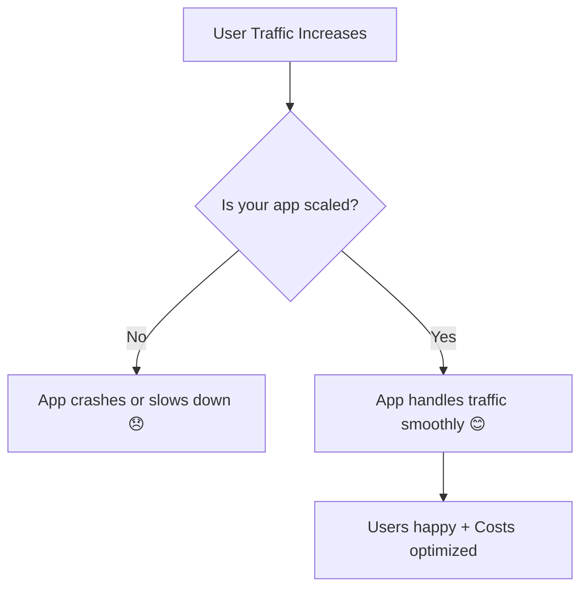
```mermaid
graph TB
    A[User Traffic Increases] --> B{Is your app scaled?}
    B -->|No| C[App crashes or slows down 😞]
    B -->|Yes| D[App handles traffic smoothly 😊]
    D --> E[Users happy + Costs optimized]
```

**Without scaling:**
- Apps crash during high traffic
- Resources wasted during low traffic
- Manual intervention needed 24/7

**With scaling:**
- Apps automatically adjust to demand
- Cost-efficient resource usage
- Better user experience

---

## 💾 Resource Limits and Requests {#resource-limits-requests}

### The Restaurant Analogy

Think of a restaurant with a **limited kitchen and dining space**:

- **Request** = "I need **at least** 2 tables reserved for my group"
- **Limit** = "I will bring **at most** 4 people"

In Kubernetes:
- **Request** = Minimum guaranteed resources your container will get
- **Limit** = Maximum resources your container can use

### Visual Representation

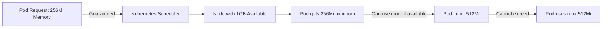
```mermaid
graph LR
    A[Pod Request: 256Mi Memory] -->|Guaranteed| B[Kubernetes Scheduler]
    B --> C[Node with 1GB Available]
    C --> D[Pod gets 256Mi minimum]
    D -->|Can use more if available| E[Pod Limit: 512Mi]
    E -->|Cannot exceed| F[Pod uses max 512Mi]
```

### How It Works

#### CPU (Compressible Resource)

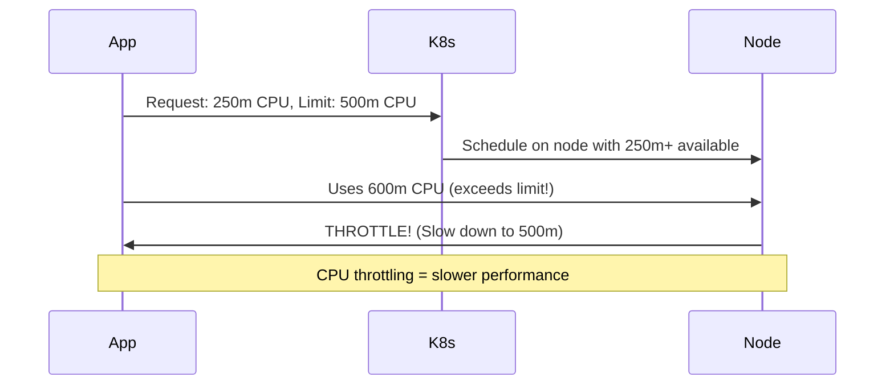
```mermaid
sequenceDiagram
    participant App
    participant K8s
    participant Node
    
    App->>K8s: Request: 250m CPU, Limit: 500m CPU
    K8s->>Node: Schedule on node with 250m+ available
    App->>Node: Uses 600m CPU (exceeds limit!)
    Node->>App: THROTTLE! (Slow down to 500m)
    Note over App,Node: CPU throttling = slower performance
```

**What happens when limit exceeded:**
- ✅ Pod keeps running
- ⚠️ CPU is throttled (slowed down)
- 📉 Performance degrades

#### Memory (Incompressible Resource)

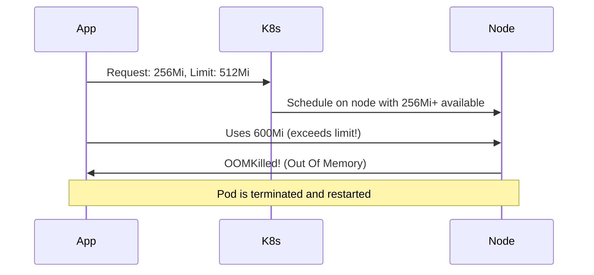
```mermaid
sequenceDiagram
    participant App
    participant K8s
    participant Node
    
    App->>K8s: Request: 256Mi, Limit: 512Mi
    K8s->>Node: Schedule on node with 256Mi+ available
    App->>Node: Uses 600Mi (exceeds limit!)
    Node->>App: OOMKilled! (Out Of Memory)
    Note over App,Node: Pod is terminated and restarted
```

**What happens when limit exceeded:**
- ❌ Pod is killed (OOMKilled)
- 🔄 Pod restarts automatically
- 📊 CrashLoopBackOff if keeps happening

### CPU Units Explained

| Value | Meaning | Example |
|-------|---------|---------|
| `1` or `1000m` | 1 full CPU core | 1 vCPU in cloud |
| `500m` | Half a CPU core | 50% of 1 vCPU |
| `250m` | Quarter CPU core | 25% of 1 vCPU |
| `100m` | 1/10th CPU core | 10% of 1 vCPU |
| `2` or `2000m` | 2 CPU cores | 2 vCPUs |

**Note:** `m` stands for "millicores" (1000m = 1 core)

### Memory Units Explained

| Unit | Meaning | Example |
|------|---------|---------|
| `Ki` | Kibibyte | 1024 bytes |
| `Mi` | Mebibyte | 1024 Ki = 1,048,576 bytes |
| `Gi` | Gibibyte | 1024 Mi = 1,073,741,824 bytes |
| `Ti` | Tebibyte | 1024 Gi |

**Common values:**
- `128Mi` = 128 Mebibytes ≈ 134 MB
- `256Mi` = 256 Mebibytes ≈ 268 MB
- `512Mi` = 512 Mebibytes ≈ 536 MB
- `1Gi` = 1 Gibibyte ≈ 1.07 GB

### Example 1: Basic Pod with Resources

```yaml
apiVersion: v1
kind: Pod
metadata:
  name: my-app-pod
spec:
  containers:
  - name: my-app
    image: nginx:latest
    resources:
      requests:
        memory: "256Mi"    # Minimum guaranteed: 256 MiB
        cpu: "250m"        # Minimum guaranteed: 0.25 CPU
      limits:
        memory: "512Mi"    # Maximum allowed: 512 MiB
        cpu: "500m"        # Maximum allowed: 0.5 CPU
```

**Save this as `pod-with-resources.yaml` and run:**
```bash
kubectl apply -f pod-with-resources.yaml
kubectl describe pod my-app-pod
```

### Example 2: Deployment with Resources

```yaml
apiVersion: apps/v1
kind: Deployment
metadata:
  name: webapp-deployment
spec:
  replicas: 3
  selector:
    matchLabels:
      app: webapp
  template:
    metadata:
      labels:
        app: webapp
    spec:
      containers:
      - name: webapp-container
        image: nginx:latest
        resources:
          requests:
            memory: "128Mi"
            cpu: "100m"
          limits:
            memory: "256Mi"
            cpu: "200m"
        ports:
        - containerPort: 80
```

**Save as `deployment-with-resources.yaml` and deploy:**
```bash
kubectl apply -f deployment-with-resources.yaml
kubectl get pods
kubectl top pods  # Check actual resource usage
```

### Resource Quality of Service (QoS) Classes

Kubernetes assigns QoS classes based on requests and limits:

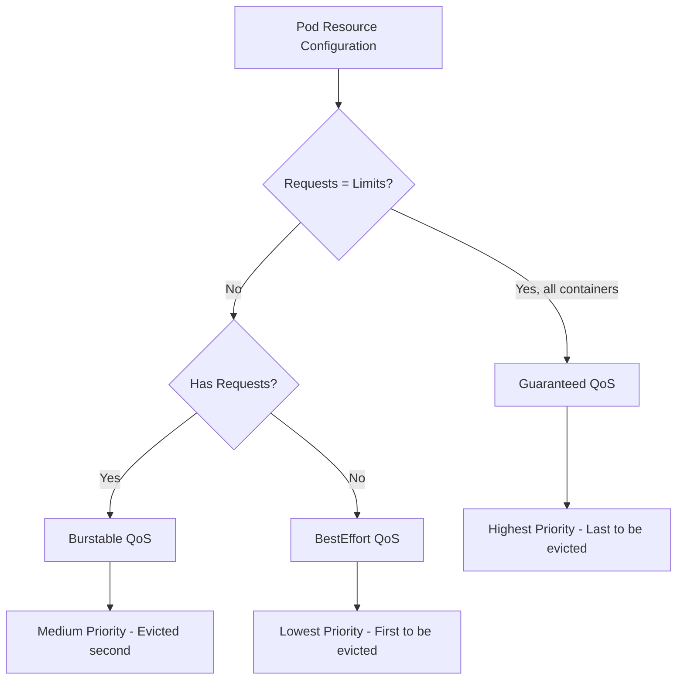
```mermaid
graph TD
    A[Pod Resource Configuration] --> B{Requests = Limits?}
    B -->|Yes, all containers| C[Guaranteed QoS]
    B -->|No| D{Has Requests?}
    D -->|Yes| E[Burstable QoS]
    D -->|No| F[BestEffort QoS]
    
    C --> G[Highest Priority - Last to be evicted]
    E --> H[Medium Priority - Evicted second]
    F --> I[Lowest Priority - First to be evicted]
```

| QoS Class | Configuration | Priority | When Evicted |
|-----------|--------------|----------|--------------|
| **Guaranteed** | `requests = limits` for all | Highest | Only if exceeds limits |
| **Burstable** | Has requests, but `requests < limits` | Medium | When node runs out of resources |
| **BestEffort** | No requests or limits | Lowest | First to be evicted |

---

## 📈 Horizontal Pod Autoscaling (HPA) {#horizontal-pod-autoscaling}

### The Restaurant Analogy

During lunch rush:
- **More customers** = Hire **more waiters** (scale OUT)
- **Fewer customers** = Send waiters home (scale IN)

HPA does the same with **pod replicas**!

### Visual Representation

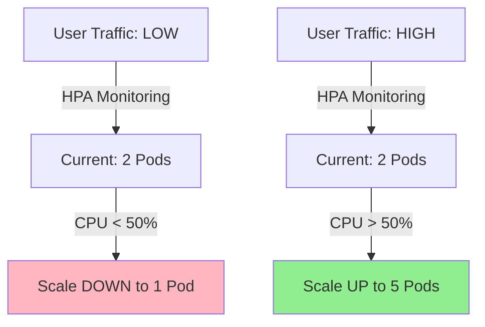
```mermaid
graph TB
    A[User Traffic: LOW] -->|HPA Monitoring| B[Current: 2 Pods]
    C[User Traffic: HIGH] -->|HPA Monitoring| D[Current: 2 Pods]
    D -->|CPU > 50%| E[Scale UP to 5 Pods]
    B -->|CPU < 50%| F[Scale DOWN to 1 Pod]
    
    style E fill:#90EE90
    style F fill:#FFB6C1
```

### How HPA Works

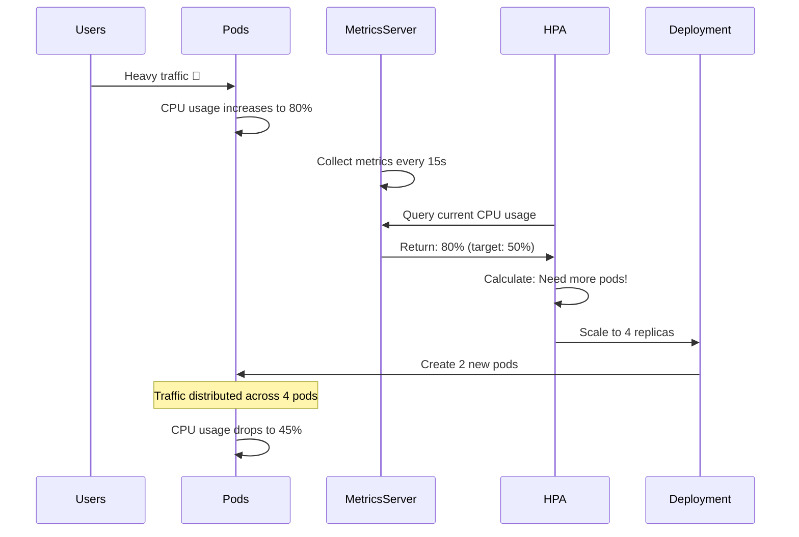
```mermaid
sequenceDiagram
    participant Users
    participant Pods
    participant MetricsServer
    participant HPA
    participant Deployment
    
    Users->>Pods: Heavy traffic 🚦
    Pods->>Pods: CPU usage increases to 80%
    MetricsServer->>MetricsServer: Collect metrics every 15s
    HPA->>MetricsServer: Query current CPU usage
    MetricsServer->>HPA: Return: 80% (target: 50%)
    HPA->>HPA: Calculate: Need more pods!
    HPA->>Deployment: Scale to 4 replicas
    Deployment->>Pods: Create 2 new pods
    Note over Pods: Traffic distributed across 4 pods
    Pods->>Pods: CPU usage drops to 45%
```

### HPA Formula

The HPA uses this formula to calculate desired replicas:

```
desiredReplicas = ceil[currentReplicas × (currentMetricValue / desiredMetricValue)]
```

**Example:**
- Current replicas: 2
- Current CPU: 90%
- Target CPU: 50%

```
desiredReplicas = ceil[2 × (90 / 50)]
                = ceil[2 × 1.8]
                = ceil[3.6]
                = 4 pods
```

### Prerequisites for HPA

1. **Metrics Server** must be installed:

```bash
# Install Metrics Server
kubectl apply -f https://github.com/kubernetes-sigs/metrics-server/releases/latest/download/components.yaml

# Verify installation
kubectl get pods -n kube-system | grep metrics-server

# Check if metrics are available
kubectl top nodes
kubectl top pods
```

### Example 1: Basic HPA with CPU

**Step 1:** Create a deployment with resource requests

```yaml
apiVersion: apps/v1
kind: Deployment
metadata:
  name: php-apache
spec:
  replicas: 1
  selector:
    matchLabels:
      app: php-apache
  template:
    metadata:
      labels:
        app: php-apache
    spec:
      containers:
      - name: php-apache
        image: registry.k8s.io/hpa-example
        ports:
        - containerPort: 80
        resources:
          requests:
            cpu: 200m      # IMPORTANT: HPA needs requests!
          limits:
            cpu: 500m
---
apiVersion: v1
kind: Service
metadata:
  name: php-apache
spec:
  selector:
    app: php-apache
  ports:
  - port: 80
  type: ClusterIP
```

**Save as `hpa-deployment.yaml` and apply:**
```bash
kubectl apply -f hpa-deployment.yaml
```

**Step 2:** Create HPA resource

```yaml
apiVersion: autoscaling/v2
kind: HorizontalPodAutoscaler
metadata:
  name: php-apache-hpa
spec:
  scaleTargetRef:
    apiVersion: apps/v1
    kind: Deployment
    name: php-apache
  minReplicas: 1              # Minimum pods
  maxReplicas: 10             # Maximum pods
  metrics:
  - type: Resource
    resource:
      name: cpu
      target:
        type: Utilization
        averageUtilization: 50  # Target: Keep CPU at 50%
```

**Save as `hpa.yaml` and apply:**
```bash
kubectl apply -f hpa.yaml
```

**Or use kubectl command:**
```bash
kubectl autoscale deployment php-apache \
  --cpu-percent=50 \
  --min=1 \
  --max=10
```

**Step 3:** Monitor HPA

```bash
# Watch HPA status
kubectl get hpa php-apache-hpa --watch

# Detailed HPA information
kubectl describe hpa php-apache-hpa

# Check pod count
kubectl get pods | grep php-apache
```

**Step 4:** Generate load to test HPA

```bash
# Run a load generator pod
kubectl run -i --tty load-generator --rm --image=busybox:1.28 --restart=Never -- /bin/sh

# Inside the pod, run:
while true; do wget -q -O- http://php-apache; done
```

**In another terminal, watch the scaling:**
```bash
kubectl get hpa php-apache-hpa --watch
```

You should see output like:
```
NAME              REFERENCE                TARGETS   MINPODS   MAXPODS   REPLICAS   AGE
php-apache-hpa    Deployment/php-apache    0%/50%    1         10        1          1m
php-apache-hpa    Deployment/php-apache    250%/50%  1         10        1          2m
php-apache-hpa    Deployment/php-apache    250%/50%  1         10        5          2m30s
php-apache-hpa    Deployment/php-apache    45%/50%   1         10        5          3m
```

**Stop the load:**
- Press `Ctrl+C` in the load generator terminal
- Wait 5 minutes (default cooldown period)
- Watch pods scale down to 1

### Example 2: HPA with Multiple Metrics

```yaml
apiVersion: autoscaling/v2
kind: HorizontalPodAutoscaler
metadata:
  name: multi-metric-hpa
spec:
  scaleTargetRef:
    apiVersion: apps/v1
    kind: Deployment
    name: webapp-deployment
  minReplicas: 2
  maxReplicas: 20
  metrics:
  - type: Resource
    resource:
      name: cpu
      target:
        type: Utilization
        averageUtilization: 70      # Scale if CPU > 70%
  - type: Resource
    resource:
      name: memory
      target:
        type: Utilization
        averageUtilization: 80      # Scale if Memory > 80%
  behavior:
    scaleDown:
      stabilizationWindowSeconds: 300  # Wait 5 min before scaling down
      policies:
      - type: Percent
        value: 50                      # Scale down max 50% of pods
        periodSeconds: 60              # Every 60 seconds
    scaleUp:
      stabilizationWindowSeconds: 0    # Scale up immediately
      policies:
      - type: Percent
        value: 100                     # Can double pods
        periodSeconds: 15              # Every 15 seconds
```

### HPA Behavior Tuning

| Parameter | Default | Purpose |
|-----------|---------|---------|
| `stabilizationWindowSeconds` | 300s (scale down) | Prevents flapping |
| `--horizontal-pod-autoscaler-sync-period` | 15s | How often HPA checks metrics |
| `--horizontal-pod-autoscaler-downscale-stabilization` | 5m | Scale down cooldown |
| `--horizontal-pod-autoscaler-cpu-initialization-period` | 5m | Ignore CPU during pod startup |

### Common HPA Issues

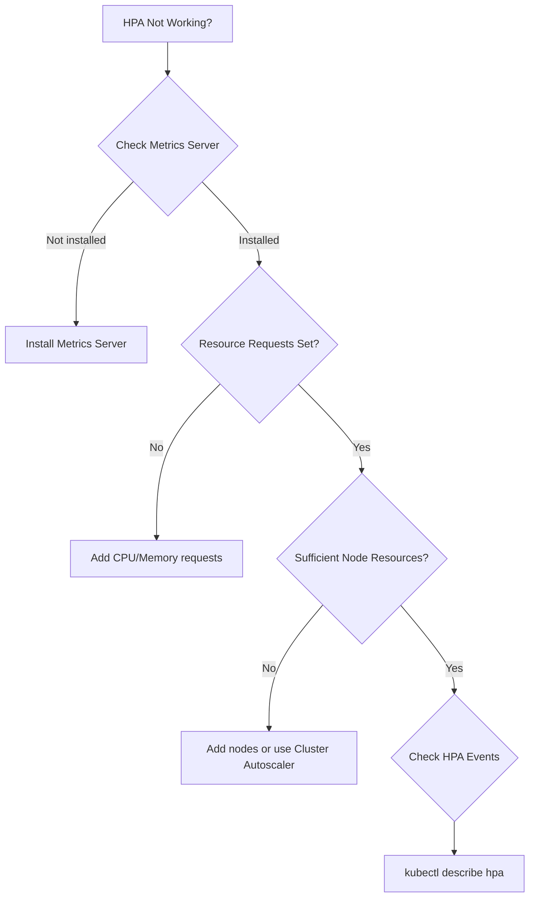
```mermaid
graph TD
    A[HPA Not Working?] --> B{Check Metrics Server}
    B -->|Not installed| C[Install Metrics Server]
    B -->|Installed| D{Resource Requests Set?}
    D -->|No| E[Add CPU/Memory requests]
    D -->|Yes| F{Sufficient Node Resources?}
    F -->|No| G[Add nodes or use Cluster Autoscaler]
    F -->|Yes| H{Check HPA Events}
    H --> I[kubectl describe hpa]
```

---

## 📊 Vertical Pod Autoscaling (VPA) {#vertical-pod-autoscaling}

### The Restaurant Analogy

Instead of hiring more waiters (HPA):
- **Upgrade your waiter** with a bigger tray (more CPU)
- **Give them better shoes** for faster service (more memory)

VPA adjusts the **resources** of existing pods!

### Visual Representation

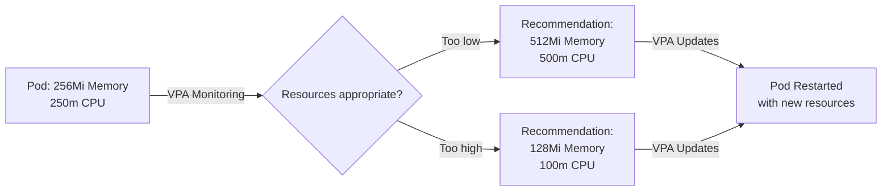
```mermaid
graph LR
    A[Pod: 256Mi Memory<br/>250m CPU] -->|VPA Monitoring| B{Resources appropriate?}
    B -->|Too low| C[Recommendation:<br/>512Mi Memory<br/>500m CPU]
    B -->|Too high| D[Recommendation:<br/>128Mi Memory<br/>100m CPU]
    C -->|VPA Updates| E[Pod Restarted<br/>with new resources]
    D -->|VPA Updates| E
```

### How VPA Works

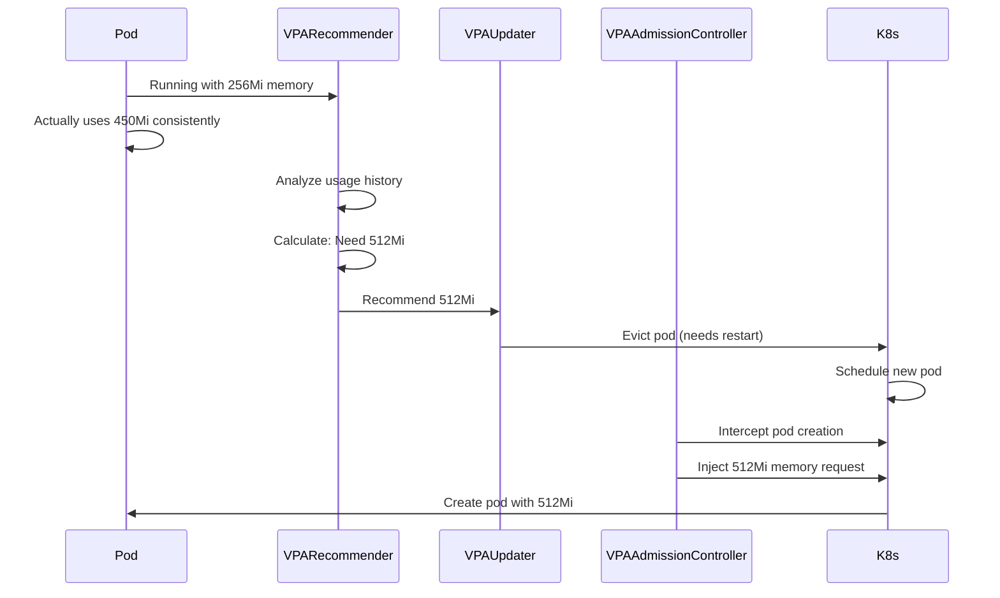
```mermaid
sequenceDiagram
    participant Pod
    participant VPARecommender
    participant VPAUpdater
    participant VPAAdmissionController
    participant K8s
    
    Pod->>VPARecommender: Running with 256Mi memory
    Pod->>Pod: Actually uses 450Mi consistently
    VPARecommender->>VPARecommender: Analyze usage history
    VPARecommender->>VPARecommender: Calculate: Need 512Mi
    VPARecommender->>VPAUpdater: Recommend 512Mi
    VPAUpdater->>K8s: Evict pod (needs restart)
    K8s->>K8s: Schedule new pod
    VPAAdmissionController->>K8s: Intercept pod creation
    VPAAdmissionController->>K8s: Inject 512Mi memory request
    K8s->>Pod: Create pod with 512Mi
```

### VPA Components

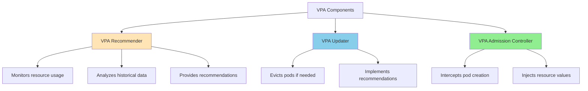
```mermaid
graph TB
    A[VPA Components] --> B[VPA Recommender]
    A --> C[VPA Updater]
    A --> D[VPA Admission Controller]
    
    B --> B1[Monitors resource usage]
    B --> B2[Analyzes historical data]
    B --> B3[Provides recommendations]
    
    C --> C1[Evicts pods if needed]
    C --> C2[Implements recommendations]
    
    D --> D1[Intercepts pod creation]
    D --> D2[Injects resource values]
    
    style B fill:#FFE4B5
    style C fill:#87CEEB
    style D fill:#90EE90
```

### VPA Update Modes

| Mode | Behavior | When to Use |
|------|----------|-------------|
| **Off** | Only provides recommendations, doesn't change pods | Testing/Learning phase |
| **Initial** | Sets resources only when pod is created | Want stability, apply once |
| **Recreate** | Evicts and recreates pods with new resources | Production (default) |
| **Auto** | Same as Recreate (future: in-place updates) | Production |

### Installing VPA

**Method 1: Using Official Script**

```bash
# Clone the autoscaler repository
git clone https://github.com/kubernetes/autoscaler.git
cd autoscaler/vertical-pod-autoscaler/

# Install VPA
./hack/vpa-up.sh

# Verify installation
kubectl get pods -n kube-system | grep vpa
```

Expected output:
```
vpa-admission-controller-xxxxx    1/1     Running   0          1m
vpa-recommender-xxxxx             1/1     Running   0          1m
vpa-updater-xxxxx                 1/1     Running   0          1m
```

**Method 2: Using YAML**

```bash
# Apply VPA components
kubectl apply -f https://github.com/kubernetes/autoscaler/releases/latest/download/vertical-pod-autoscaler.yaml

# Verify
kubectl get crd | grep verticalpodautoscaler
```

### Example 1: VPA in Recommendation Mode

**Step 1:** Create a deployment

```yaml
apiVersion: apps/v1
kind: Deployment
metadata:
  name: webapp-vpa
spec:
  replicas: 2
  selector:
    matchLabels:
      app: webapp-vpa
  template:
    metadata:
      labels:
        app: webapp-vpa
    spec:
      containers:
      - name: webapp
        image: nginx:latest
        resources:
          requests:
            cpu: 100m
            memory: 128Mi
          limits:
            cpu: 200m
            memory: 256Mi
```

**Save as `vpa-deployment.yaml`:**
```bash
kubectl apply -f vpa-deployment.yaml
```

**Step 2:** Create VPA in recommendation mode

```yaml
apiVersion: autoscaling.k8s.io/v1
kind: VerticalPodAutoscaler
metadata:
  name: webapp-vpa-recommender
spec:
  targetRef:
    apiVersion: apps/v1
    kind: Deployment
    name: webapp-vpa
  updatePolicy:
    updateMode: "Off"    # Only recommend, don't change pods
```

**Save as `vpa-recommender.yaml`:**
```bash
kubectl apply -f vpa-recommender.yaml
```

**Step 3:** Check recommendations

```bash
# Wait a few minutes for VPA to collect data
sleep 180

# Get VPA recommendations
kubectl describe vpa webapp-vpa-recommender
```

Output will show:
```yaml
Recommendation:
  Container Recommendations:
    Container Name:  webapp
    Lower Bound:
      Cpu:     50m
      Memory:  100Mi
    Target:
      Cpu:     150m
      Memory:  200Mi
    Uncapped Target:
      Cpu:     150m
      Memory:  200Mi
    Upper Bound:
      Cpu:     300m
      Memory:  400Mi
```

**Explanation:**
- **Lower Bound**: Minimum recommended resources
- **Target**: VPA's recommendation for optimal performance
- **Upper Bound**: Maximum resources it thinks you'll need
- **Uncapped Target**: Recommendation without any constraints

### Example 2: VPA in Auto Mode

```yaml
apiVersion: autoscaling.k8s.io/v1
kind: VerticalPodAutoscaler
metadata:
  name: webapp-vpa-auto
spec:
  targetRef:
    apiVersion: apps/v1
    kind: Deployment
    name: webapp-vpa
  updatePolicy:
    updateMode: "Auto"      # Automatically update pods
  resourcePolicy:
    containerPolicies:
    - containerName: webapp
      minAllowed:           # Don't go below these values
        cpu: 50m
        memory: 100Mi
      maxAllowed:           # Don't exceed these values
        cpu: 1
        memory: 1Gi
      controlledResources:  # What to manage
      - cpu
      - memory
```

**Save as `vpa-auto.yaml`:**
```bash
kubectl apply -f vpa-auto.yaml

# Watch pods being recreated with new resources
kubectl get pods -w
```

### Example 3: Generate Load to Test VPA

**Create a CPU-intensive deployment:**

```yaml
apiVersion: apps/v1
kind: Deployment
metadata:
  name: stress-test
spec:
  replicas: 1
  selector:
    matchLabels:
      app: stress-test
  template:
    metadata:
      labels:
        app: stress-test
    spec:
      containers:
      - name: stress
        image: polinux/stress
        command: ["stress"]
        args: ["--cpu", "2", "--vm", "1", "--vm-bytes", "250M"]
        resources:
          requests:
            cpu: 100m
            memory: 100Mi
          limits:
            cpu: 500m
            memory: 500Mi
---
apiVersion: autoscaling.k8s.io/v1
kind: VerticalPodAutoscaler
metadata:
  name: stress-test-vpa
spec:
  targetRef:
    apiVersion: apps/v1
    kind: Deployment
    name: stress-test
  updatePolicy:
    updateMode: "Auto"
```

**Run the test:**
```bash
kubectl apply -f stress-test.yaml

# Watch VPA recommendations
kubectl describe vpa stress-test-vpa

# After a few minutes, VPA will restart pod with higher resources
kubectl get pods
kubectl describe pod stress-test-xxxxx | grep -A 10 "Requests:"
```

### VPA vs HPA Compatibility

⚠️ **WARNING:** Don't use VPA and HPA together on the same CPU/Memory metrics!

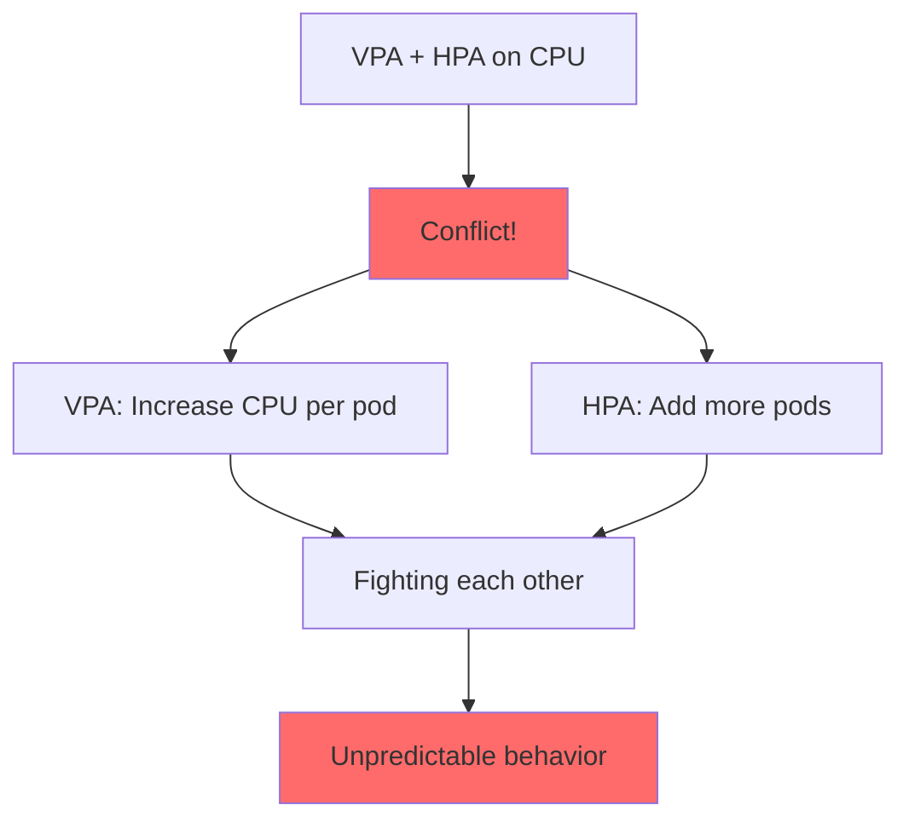
```mermaid
graph TD
    A[VPA + HPA on CPU] --> B[Conflict!]
    B --> C[VPA: Increase CPU per pod]
    B --> D[HPA: Add more pods]
    C --> E[Fighting each other]
    D --> E
    E --> F[Unpredictable behavior]
    
    style B fill:#FF6B6B
    style F fill:#FF6B6B
```

**Safe combinations:**
- ✅ HPA on CPU + VPA on Memory
- ✅ HPA on custom metrics + VPA on CPU/Memory
- ❌ HPA on CPU + VPA on CPU (DON'T DO THIS!)

---

## 🖥️ Cluster Autoscaling (AWS EKS) {#cluster-autoscaling}

### What is Cluster Autoscaling?

Think of your Kubernetes cluster like a **parking lot**:

- **HPA** = Adding more cars (pods) to the parking lot
- **VPA** = Upgrading to bigger cars (more resources per pod)  
- **Cluster Autoscaler** = Building more parking spaces (nodes) when the lot is full!

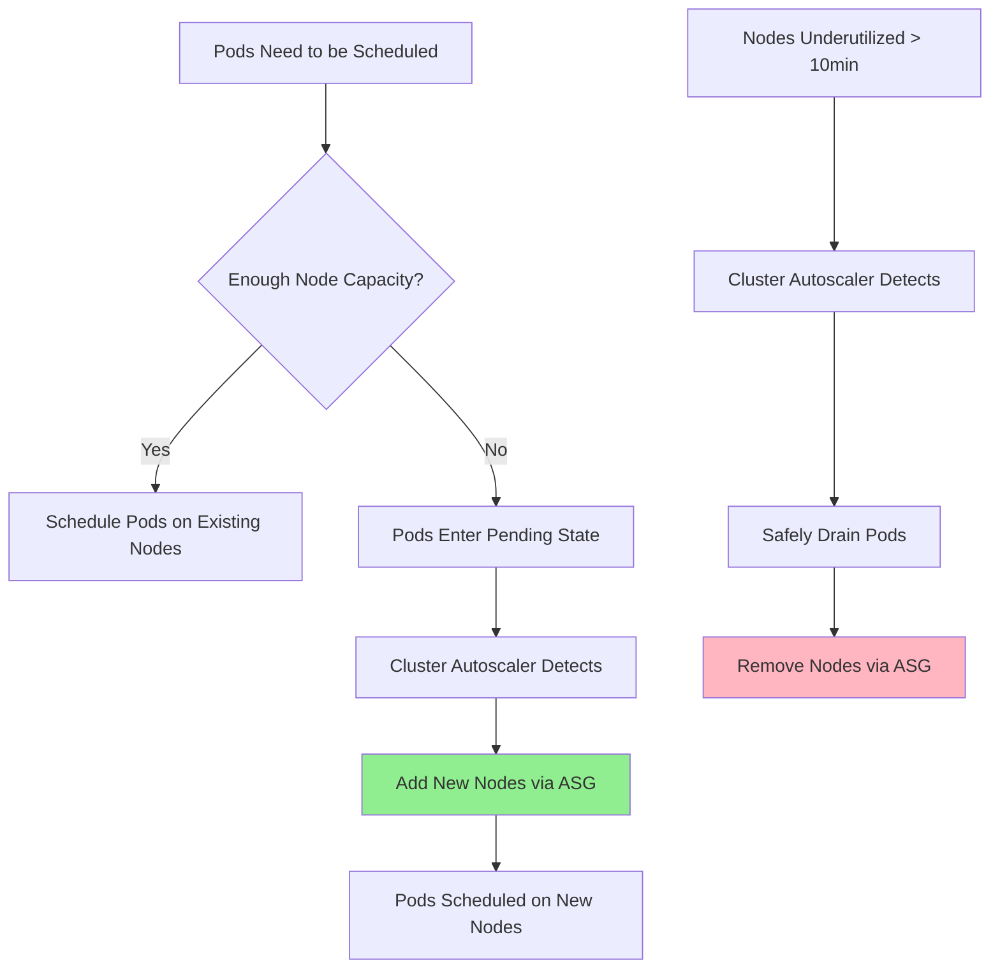
```mermaid
graph TB
    A[Pods Need to be Scheduled] --> B{Enough Node Capacity?}
    B -->|Yes| C[Schedule Pods on Existing Nodes]
    B -->|No| D[Pods Enter Pending State]
    D --> E[Cluster Autoscaler Detects]
    E --> F[Add New Nodes via ASG]
    F --> G[Pods Scheduled on New Nodes]
    
    H[Nodes Underutilized > 10min] --> I[Cluster Autoscaler Detects]
    I --> J[Safely Drain Pods]
    J --> K[Remove Nodes via ASG]
    
    style F fill:#90EE90
    style K fill:#FFB6C1
```

### How It Works on AWS EKS

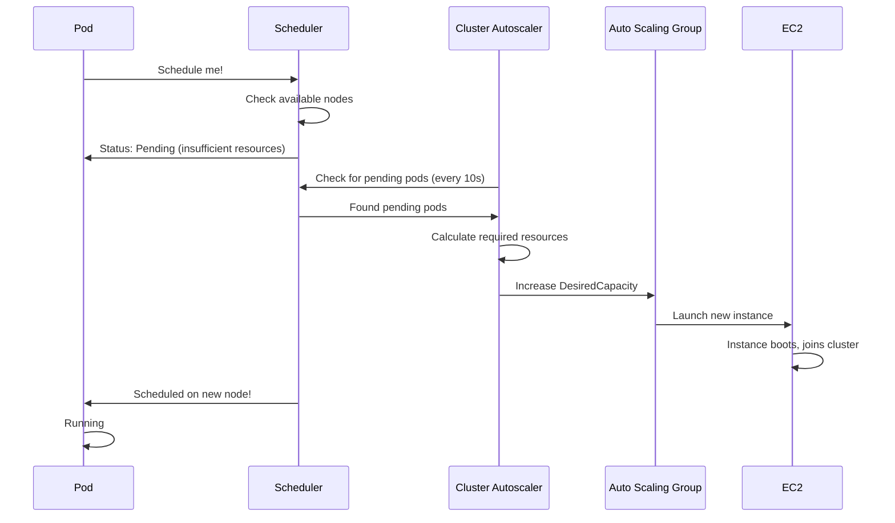
```mermaid
sequenceDiagram
    participant Pod
    participant Scheduler
    participant CA as Cluster Autoscaler
    participant ASG as Auto Scaling Group
    participant EC2
    
    Pod->>Scheduler: Schedule me!
    Scheduler->>Scheduler: Check available nodes
    Scheduler->>Pod: Status: Pending (insufficient resources)
    
    CA->>Scheduler: Check for pending pods (every 10s)
    Scheduler->>CA: Found pending pods
    CA->>CA: Calculate required resources
    CA->>ASG: Increase DesiredCapacity
    ASG->>EC2: Launch new instance
    EC2->>EC2: Instance boots, joins cluster
    Scheduler->>Pod: Scheduled on new node!
    Pod->>Pod: Running
```

### Cluster Autoscaler vs Karpenter

AWS offers two solutions for node autoscaling:

| Feature | Cluster Autoscaler (CA) | Karpenter |
|---------|------------------------|-----------|
| **Release Year** | 2016 (Mature) | 2021 (Modern) |
| **Works With** | Auto Scaling Groups (ASG) | EC2 Fleet API directly |
| **Node Types** | Fixed per ASG | Flexible, any instance type |
| **Scaling Speed** | 2-3 minutes | < 1 minute |
| **Setup Complexity** | Moderate | Simple |
| **Multi-cloud** | Yes (AWS, GCP, Azure) | AWS-focused |
| **Spot Integration** | Basic | Advanced |
| **Cost Optimization** | Good | Excellent |
| **Best For** | Traditional workloads, multi-cloud | AWS-native, cost-sensitive, diverse workloads |

### Visual Comparison

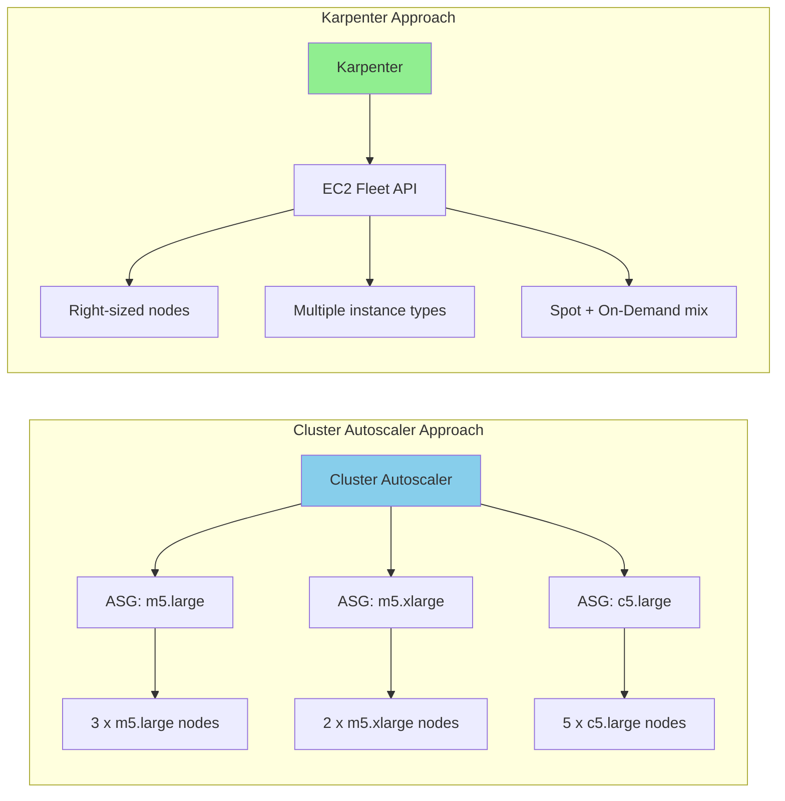
```mermaid
graph LR
    subgraph "Cluster Autoscaler Approach"
        CA1[Cluster Autoscaler] --> ASG1[ASG: m5.large]
        CA1 --> ASG2[ASG: m5.xlarge]
        CA1 --> ASG3[ASG: c5.large]
        ASG1 --> N1[3 x m5.large nodes]
        ASG2 --> N2[2 x m5.xlarge nodes]
        ASG3 --> N3[5 x c5.large nodes]
    end
    
    subgraph "Karpenter Approach"
        K[Karpenter] --> EC2[EC2 Fleet API]
        EC2 --> N4[Right-sized nodes]
        EC2 --> N5[Multiple instance types]
        EC2 --> N6[Spot + On-Demand mix]
    end
    
    style CA1 fill:#87CEEB
    style K fill:#90EE90
```

### Architecture: All Autoscalers Together

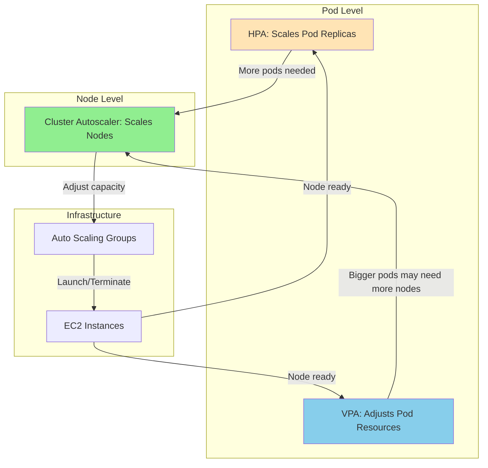
```mermaid
graph TB
    subgraph "Pod Level"
        HPA[HPA: Scales Pod Replicas]
        VPA[VPA: Adjusts Pod Resources]
    end
    
    subgraph "Node Level"
        CA[Cluster Autoscaler: Scales Nodes]
    end
    
    subgraph "Infrastructure"
        ASG[Auto Scaling Groups]
        EC2[EC2 Instances]
    end
    
    HPA -->|More pods needed| CA
    VPA -->|Bigger pods may need more nodes| CA
    CA -->|Adjust capacity| ASG
    ASG -->|Launch/Terminate| EC2
    EC2 -->|Node ready| HPA
    EC2 -->|Node ready| VPA
    
    style HPA fill:#FFE4B5
    style VPA fill:#87CEEB
    style CA fill:#90EE90
```

---

## 🚀 AWS EKS Cluster Autoscaler Setup {#eks-cluster-autoscaler-setup}

### Prerequisites

```bash
# Check your EKS cluster
kubectl cluster-info

# Check your node groups
aws eks list-nodegroups --cluster-name <your-cluster-name>

# Get Auto Scaling Group details
aws autoscaling describe-auto-scaling-groups \
  --query "AutoScalingGroups[? Tags[? (Key=='eks:cluster-name') && Value=='<your-cluster-name>']].[AutoScalingGroupName, MinSize, MaxSize, DesiredCapacity]" \
  --output table
```

### Step 1: Verify ASG Tags

Cluster Autoscaler uses **auto-discovery** to find node groups. Your ASG must have these tags:

| Tag Key | Tag Value |
|---------|-----------|
| `k8s.io/cluster-autoscaler/<cluster-name>` | `owned` |
| `k8s.io/cluster-autoscaler/enabled` | `true` |

**Check tags:**
```bash
aws autoscaling describe-auto-scaling-groups \
  --auto-scaling-group-names <your-asg-name> \
  --query "AutoScalingGroups[].Tags"
```

**If using eksctl** (recommended), these tags are added automatically.

**If tags are missing, add them:**
```bash
aws autoscaling create-or-update-tags --tags \
  ResourceId=<your-asg-name>,ResourceType=auto-scaling-group,Key=k8s.io/cluster-autoscaler/<cluster-name>,Value=owned,PropagateAtLaunch=true \
  ResourceId=<your-asg-name>,ResourceType=auto-scaling-group,Key=k8s.io/cluster-autoscaler/enabled,Value=true,PropagateAtLaunch=true
```

### Step 2: Create IAM Policy

Create a policy that allows Cluster Autoscaler to manage ASGs:

```bash
cat <<EOF > cluster-autoscaler-policy.json
{
  "Version": "2012-10-17",
  "Statement": [
    {
      "Effect": "Allow",
      "Action": [
        "autoscaling:DescribeAutoScalingGroups",
        "autoscaling:DescribeAutoScalingInstances",
        "autoscaling:DescribeLaunchConfigurations",
        "autoscaling:DescribeTags",
        "autoscaling:SetDesiredCapacity",
        "autoscaling:TerminateInstanceInAutoScalingGroup",
        "ec2:DescribeLaunchTemplateVersions",
        "ec2:DescribeInstanceTypes"
      ],
      "Resource": "*"
    }
  ]
}
EOF

# Create the policy
aws iam create-policy \
  --policy-name AmazonEKSClusterAutoscalerPolicy \
  --policy-document file://cluster-autoscaler-policy.json
```

### Step 3: Create IAM Role for Service Account (IRSA)

**Method 1: Using eksctl (Recommended)**

```bash
# Replace with your cluster name and AWS account ID
CLUSTER_NAME="your-cluster-name"
AWS_ACCOUNT_ID=$(aws sts get-caller-identity --query Account --output text)

# Create OIDC provider (if not already created)
eksctl utils associate-iam-oidc-provider \
  --cluster ${CLUSTER_NAME} \
  --approve

# Create service account with IAM role
eksctl create iamserviceaccount \
  --cluster=${CLUSTER_NAME} \
  --namespace=kube-system \
  --name=cluster-autoscaler \
  --attach-policy-arn=arn:aws:iam::${AWS_ACCOUNT_ID}:policy/AmazonEKSClusterAutoscalerPolicy \
  --override-existing-serviceaccounts \
  --approve
```

**Method 2: Using AWS CLI**

```bash
# Get OIDC provider URL
OIDC_ID=$(aws eks describe-cluster --name ${CLUSTER_NAME} --query "cluster.identity.oidc.issuer" --output text | cut -d '/' -f 5)

# Create trust policy
cat <<EOF > trust-policy.json
{
  "Version": "2012-10-17",
  "Statement": [
    {
      "Effect": "Allow",
      "Principal": {
        "Federated": "arn:aws:iam::${AWS_ACCOUNT_ID}:oidc-provider/oidc.eks.${AWS_REGION}.amazonaws.com/id/${OIDC_ID}"
      },
      "Action": "sts:AssumeRoleWithWebIdentity",
      "Condition": {
        "StringEquals": {
          "oidc.eks.${AWS_REGION}.amazonaws.com/id/${OIDC_ID}:sub": "system:serviceaccount:kube-system:cluster-autoscaler",
          "oidc.eks.${AWS_REGION}.amazonaws.com/id/${OIDC_ID}:aud": "sts.amazonaws.com"
        }
      }
    }
  ]
}
EOF

# Create IAM role
aws iam create-role \
  --role-name AmazonEKSClusterAutoscalerRole \
  --assume-role-policy-document file://trust-policy.json

# Attach policy to role
aws iam attach-role-policy \
  --role-name AmazonEKSClusterAutoscalerRole \
  --policy-arn arn:aws:iam::${AWS_ACCOUNT_ID}:policy/AmazonEKSClusterAutoscalerPolicy
```

### Step 4: Deploy Cluster Autoscaler

```bash
# Download the deployment manifest
curl -o cluster-autoscaler-autodiscover.yaml \
  https://raw.githubusercontent.com/kubernetes/autoscaler/master/cluster-autoscaler/cloudprovider/aws/examples/cluster-autoscaler-autodiscover.yaml
```

**Edit the manifest:**

```yaml
apiVersion: apps/v1
kind: Deployment
metadata:
  name: cluster-autoscaler
  namespace: kube-system
  labels:
    app: cluster-autoscaler
spec:
  replicas: 1
  selector:
    matchLabels:
      app: cluster-autoscaler
  template:
    metadata:
      labels:
        app: cluster-autoscaler
    spec:
      priorityClassName: system-cluster-critical
      securityContext:
        runAsNonRoot: true
        runAsUser: 65534
        fsGroup: 65534
      serviceAccountName: cluster-autoscaler
      containers:
      - image: registry.k8s.io/autoscaling/cluster-autoscaler:v1.30.0  # Match your K8s version!
        name: cluster-autoscaler
        resources:
          limits:
            cpu: 100m
            memory: 600Mi
          requests:
            cpu: 100m
            memory: 600Mi
        command:
        - ./cluster-autoscaler
        - --v=4
        - --stderrthreshold=info
        - --cloud-provider=aws
        - --skip-nodes-with-local-storage=false
        - --expander=least-waste
        - --node-group-auto-discovery=asg:tag=k8s.io/cluster-autoscaler/enabled,k8s.io/cluster-autoscaler/<YOUR-CLUSTER-NAME>  # CHANGE THIS!
        - --balance-similar-node-groups
        - --skip-nodes-with-system-pods=false
        volumeMounts:
        - name: ssl-certs
          mountPath: /etc/ssl/certs/ca-certificates.crt
          readOnly: true
      volumes:
      - name: ssl-certs
        hostPath:
          path: /etc/ssl/certs/ca-bundle.crt
```

**Important changes to make:**
1. Replace `<YOUR-CLUSTER-NAME>` with your actual cluster name
2. Match the image version to your Kubernetes version (see table below)

| Kubernetes Version | Cluster Autoscaler Version |
|-------------------|---------------------------|
| 1.30 | v1.30.x |
| 1.29 | v1.29.x |
| 1.28 | v1.28.x |
| 1.27 | v1.27.x |

Find versions at: https://github.com/kubernetes/autoscaler/releases

**Apply the manifest:**
```bash
# Apply the deployment
kubectl apply -f cluster-autoscaler-autodiscover.yaml

# Prevent CA pod from being evicted
kubectl -n kube-system annotate deployment.apps/cluster-autoscaler \
  cluster-autoscaler.kubernetes.io/safe-to-evict="false"
```

### Step 5: Verify Installation

```bash
# Check if CA pod is running
kubectl get pods -n kube-system | grep cluster-autoscaler

# Check logs
kubectl -n kube-system logs -f deployment/cluster-autoscaler

# Check for errors
kubectl -n kube-system describe deployment cluster-autoscaler
```

**Healthy logs look like:**
```
I1014 10:30:15.123456       1 static_autoscaler.go:230] Starting main loop
I1014 10:30:15.234567       1 auto_scaling_groups.go:138] Regenerating instance to ASG map
I1014 10:30:15.345678       1 auto_scaling_groups.go:142] Regenerated instance to ASG map
```

### Step 6: Configure ASG Min/Max Capacity

```bash
# Get your ASG name
ASG_NAME=$(aws autoscaling describe-auto-scaling-groups \
  --query "AutoScalingGroups[? Tags[? (Key=='eks:cluster-name') && Value=='${CLUSTER_NAME}']].AutoScalingGroupName" \
  --output text)

# Update capacity (example: min=2, max=10)
aws autoscaling update-auto-scaling-group \
  --auto-scaling-group-name ${ASG_NAME} \
  --min-size 2 \
  --max-size 10

# Verify
aws autoscaling describe-auto-scaling-groups \
  --auto-scaling-group-names ${ASG_NAME} \
  --query "AutoScalingGroups[].[MinSize,MaxSize,DesiredCapacity]"
```

---

## 🧪 Testing Cluster Autoscaler {#testing-cluster-autoscaler}

### Lab 1: Scale Up Test

**Terminal 1: Watch Cluster Autoscaler logs**
```bash
kubectl -n kube-system logs -f deployment/cluster-autoscaler
```

**Terminal 2: Watch nodes**
```bash
watch -n 2 "kubectl get nodes"
```

**Terminal 3: Deploy a resource-hungry application**

```yaml
apiVersion: apps/v1
kind: Deployment
metadata:
  name: scale-test
spec:
  replicas: 1
  selector:
    matchLabels:
      app: scale-test
  template:
    metadata:
      labels:
        app: scale-test
    spec:
      containers:
      - name: nginx
        image: nginx
        resources:
          requests:
            cpu: 1000m      # Request 1 CPU
            memory: 1Gi     # Request 1GB RAM
          limits:
            cpu: 1000m
            memory: 1Gi
```

```bash
# Apply the deployment
kubectl apply -f scale-test.yaml

# Check pod status
kubectl get pods -o wide

# Scale up to trigger node addition
kubectl scale deployment scale-test --replicas=10

# Watch what happens
kubectl get pods -w
```

**What you'll see:**
1. Some pods become **Pending** (insufficient resources)
2. Cluster Autoscaler logs show: `"Scaling up group <asg-name>"`
3. New node appears in `kubectl get nodes` (2-3 minutes)
4. Pending pods get scheduled on new node

### Lab 2: Scale Down Test

```bash
# Scale down the deployment
kubectl scale deployment scale-test --replicas=1

# Watch Cluster Autoscaler logs
kubectl -n kube-system logs -f deployment/cluster-autoscaler
```

**What you'll see:**
1. Node becomes underutilized
2. After **10 minutes** (default), CA marks node as unneeded
3. CA logs show: `"Scale-down: node <node-name> may be removed"`
4. After **another 10 minutes**, node is drained and terminated
5. Node disappears from `kubectl get nodes`

**Note:** Scale down is **intentionally slow** to prevent flapping!

### Lab 3: Simulating Node Shortage

Create a deployment that exceeds your cluster capacity:

```yaml
apiVersion: apps/v1
kind: Deployment
metadata:
  name: nginx-overload
spec:
  replicas: 50          # More than your cluster can handle
  selector:
    matchLabels:
      app: nginx-overload
  template:
    metadata:
      labels:
        app: nginx-overload
    spec:
      containers:
      - name: nginx
        image: nginx
        resources:
          requests:
            cpu: 500m
            memory: 512Mi
```

```bash
# Apply
kubectl apply -f nginx-overload.yaml

# Watch the magic
kubectl get pods | grep Pending
kubectl get nodes -w

# Check CA events
kubectl get events --sort-by='.lastTimestamp' | grep cluster-autoscaler
```

---

## ⚡ Karpenter: The Modern Alternative {#karpenter}

### Why Karpenter?

Karpenter is AWS's next-generation autoscaler, designed to overcome Cluster Autoscaler limitations:

**Advantages:**
- ⚡ **Faster scaling** (< 1 minute vs 2-3 minutes)
- 💰 **Better cost optimization** (picks optimal instance types)
- 🎯 **More flexible** (not limited to ASG configurations)
- 🎲 **Advanced Spot integration** (handles interruptions gracefully)
- 🔧 **Simpler configuration** (no need to manage multiple ASGs)

### When to Use Karpenter vs CA

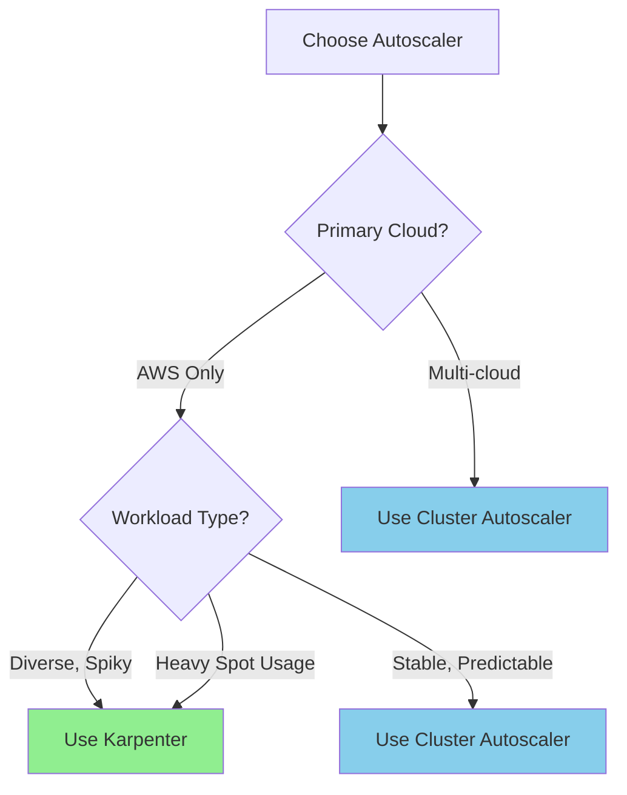
```mermaid
graph TD
    A[Choose Autoscaler] --> B{Primary Cloud?}
    B -->|AWS Only| C{Workload Type?}
    B -->|Multi-cloud| D[Use Cluster Autoscaler]
    
    C -->|Diverse, Spiky| E[Use Karpenter]
    C -->|Stable, Predictable| F[Use Cluster Autoscaler]
    C -->|Heavy Spot Usage| E
    
    style E fill:#90EE90
    style D fill:#87CEEB
    style F fill:#87CEEB
```

### Karpenter Quick Setup

**Prerequisites:**
```bash
export CLUSTER_NAME="your-cluster-name"
export AWS_REGION="us-east-1"
export AWS_ACCOUNT_ID=$(aws sts get-caller-identity --query Account --output text)
```

**Step 1: Create IAM Role for Karpenter Controller**

```bash
# Create IAM policy for Karpenter
cat <<EOF > karpenter-controller-policy.json
{
  "Version": "2012-10-17",
  "Statement": [
    {
      "Effect": "Allow",
      "Action": [
        "ec2:CreateFleet",
        "ec2:CreateLaunchTemplate",
        "ec2:CreateTags",
        "ec2:DescribeAvailabilityZones",
        "ec2:DescribeImages",
        "ec2:DescribeInstances",
        "ec2:DescribeInstanceTypeOfferings",
        "ec2:DescribeInstanceTypes",
        "ec2:DescribeLaunchTemplates",
        "ec2:DescribeSecurityGroups",
        "ec2:DescribeSubnets",
        "ec2:DescribeSpotPriceHistory",
        "ec2:RunInstances",
        "ec2:TerminateInstances",
        "pricing:GetProducts",
        "ssm:GetParameter",
        "iam:PassRole"
      ],
      "Resource": "*"
    }
  ]
}
EOF

aws iam create-policy \
  --policy-name KarpenterControllerPolicy \
  --policy-document file://karpenter-controller-policy.json
```

**Step 2: Install Karpenter using Helm**

```bash
# Add Karpenter Helm repo
helm repo add karpenter https://charts.karpenter.sh
helm repo update

# Install Karpenter
helm install karpenter karpenter/karpenter \
  --namespace karpenter --create-namespace \
  --set settings.clusterName=${CLUSTER_NAME} \
  --set settings.interruptionQueue=${CLUSTER_NAME} \
  --set controller.resources.requests.cpu=1 \
  --set controller.resources.requests.memory=1Gi \
  --set controller.resources.limits.cpu=1 \
  --set controller.resources.limits.memory=1Gi \
  --wait
```

**Step 3: Create NodePool**

```yaml
apiVersion: karpenter.sh/v1beta1
kind: NodePool
metadata:
  name: default
spec:
  template:
    spec:
      requirements:
      - key: karpenter.sh/capacity-type
        operator: In
        values: ["spot", "on-demand"]    # Can use both!
      - key: kubernetes.io/arch
        operator: In
        values: ["amd64"]
      - key: karpenter.k8s.aws/instance-category
        operator: In
        values: ["c", "m", "r"]          # Compute, general, memory
      nodeClassRef:
        name: default
  limits:
    cpu: 1000                            # Max 1000 CPUs
    memory: 1000Gi                       # Max 1000GB RAM
  disruption:
    consolidationPolicy: WhenUnderutilized
    expireAfter: 720h                    # 30 days
---
apiVersion: karpenter.k8s.aws/v1beta1
kind: EC2NodeClass
metadata:
  name: default
spec:
  amiFamily: AL2                         # Amazon Linux 2
  role: "KarpenterNodeRole"
  subnetSelectorTerms:
  - tags:
      karpenter.sh/discovery: ${CLUSTER_NAME}
  securityGroupSelectorTerms:
  - tags:
      karpenter.sh/discovery: ${CLUSTER_NAME}
```

```bash
kubectl apply -f karpenter-nodepool.yaml
```

### Karpenter vs CA: Real Example

**Scenario:** Deploy 100 nginx pods with varying CPU requirements

**With Cluster Autoscaler:**
```
Time 0:00 - Deploy 100 pods
Time 0:10 - 30 pods pending (not enough m5.large nodes)
Time 2:00 - First new m5.large node ready
Time 2:30 - 20 pods still pending
Time 4:00 - Second m5.large node ready
Time 4:30 - All pods running

Total: ~4.5 minutes, 2 additional m5.large nodes
Cost: $0.096/hour x 2 = $0.192/hour
```

**With Karpenter:**
```
Time 0:00 - Deploy 100 pods
Time 0:10 - 30 pods pending
Time 0:40 - Karpenter launches:
          - 1 x c5.large (CPU optimized)
          - 1 x m5.xlarge (general purpose)
          - Using Spot instances (70% savings!)
Time 1:00 - All pods running

Total: ~1 minute, right-sized instances
Cost: $0.045/hour (mix of spot & on-demand)
```

---

## 🔀 Comparison and When to Use What {#comparison}

### Complete Scaling Strategy

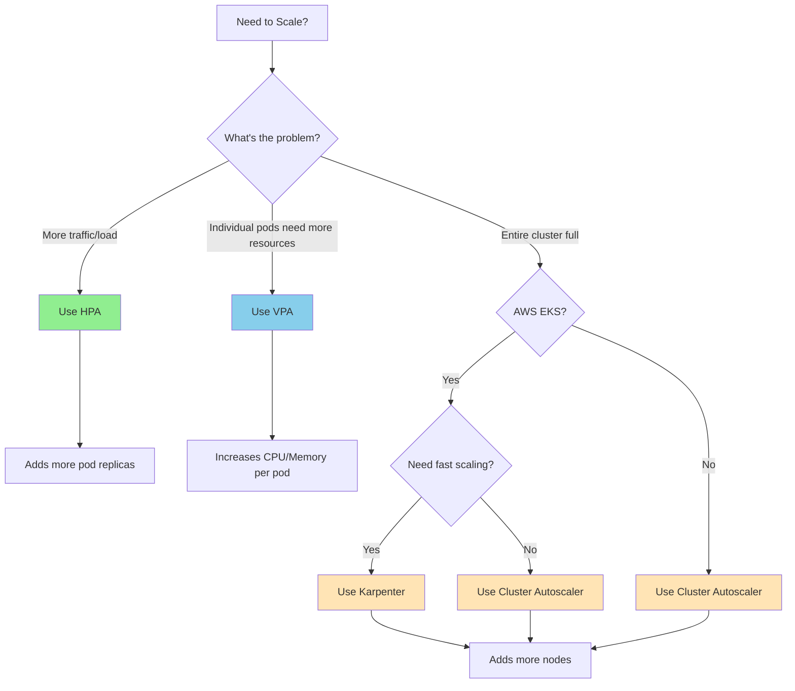
```mermaid
graph TB
    A[Need to Scale?] --> B{What's the problem?}
    B -->|More traffic/load| C[Use HPA]
    B -->|Individual pods need more resources| D[Use VPA]
    B -->|Entire cluster full| E{AWS EKS?}
    E -->|Yes| F{Need fast scaling?}
    E -->|No| G[Use Cluster Autoscaler]
    F -->|Yes| H[Use Karpenter]
    F -->|No| I[Use Cluster Autoscaler]
    
    C --> J[Adds more pod replicas]
    D --> K[Increases CPU/Memory per pod]
    G --> L[Adds more nodes]
    H --> L
    I --> L
    
    style C fill:#90EE90
    style D fill:#87CEEB
    style H fill:#FFE4B5
    style I fill:#FFE4B5
    style G fill:#FFE4B5
```

### Side-by-Side Comparison

| Feature | HPA | VPA | Cluster Autoscaler | Resource Limits/Requests |
|---------|-----|-----|-------------------|-------------------------|
| **What it does** | Changes number of pods | Changes resources per pod | Changes number of nodes | Defines resource boundaries |
| **Scaling Direction** | Horizontal (MORE pods) | Vertical (BIGGER pods) | Horizontal (MORE nodes) | N/A (Configuration) |
| **Scaling Level** | Pod level | Pod level | Node/Cluster level | Pod level |
| **Pod Disruption** | No (adds new pods) | Yes (restarts pods) | No (adds new nodes) | No |
| **Best For** | Stateless apps, traffic spikes | Stateful apps, resource optimization | Any workload that runs out of node capacity | All applications |
| **Metrics Based** | CPU, Memory, Custom | CPU, Memory | Pod pending status, node utilization | N/A |
| **Response Time** | Fast (15-60 seconds) | Slow (minutes + restart) | Slow (2-3 minutes for CA, <1min for Karpenter) | Immediate (at creation) |
| **Installed by Default** | Yes | No (manual install) | No (manual install) | Yes |
| **Works With** | Deployments, StatefulSets | Deployments, StatefulSets | All pod types | All pod types |
| **Cloud Specific** | No | No | Yes (AWS, GCP, Azure) | No |

### Decision Tree

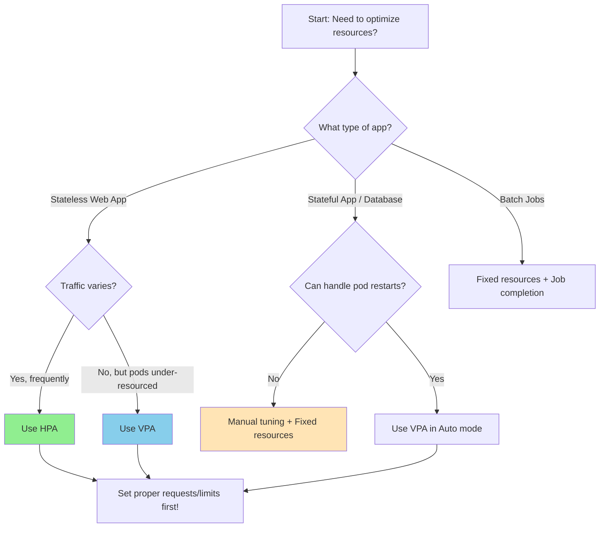
```mermaid
graph TD
    A[Start: Need to optimize resources?] --> B{What type of app?}
    
    B -->|Stateless Web App| C{Traffic varies?}
    C -->|Yes, frequently| D[Use HPA]
    C -->|No, but pods under-resourced| E[Use VPA]
    
    B -->|Stateful App / Database| F{Can handle pod restarts?}
    F -->|No| G[Manual tuning + Fixed resources]
    F -->|Yes| H[Use VPA in Auto mode]
    
    B -->|Batch Jobs| I[Fixed resources + Job completion]
    
    D --> J[Set proper requests/limits first!]
    E --> J
    H --> J
    
    style D fill:#90EE90
    style E fill:#87CEEB
    style G fill:#FFE4B5
```

### Using All Autoscalers Together

**The Perfect Combination for AWS EKS:**

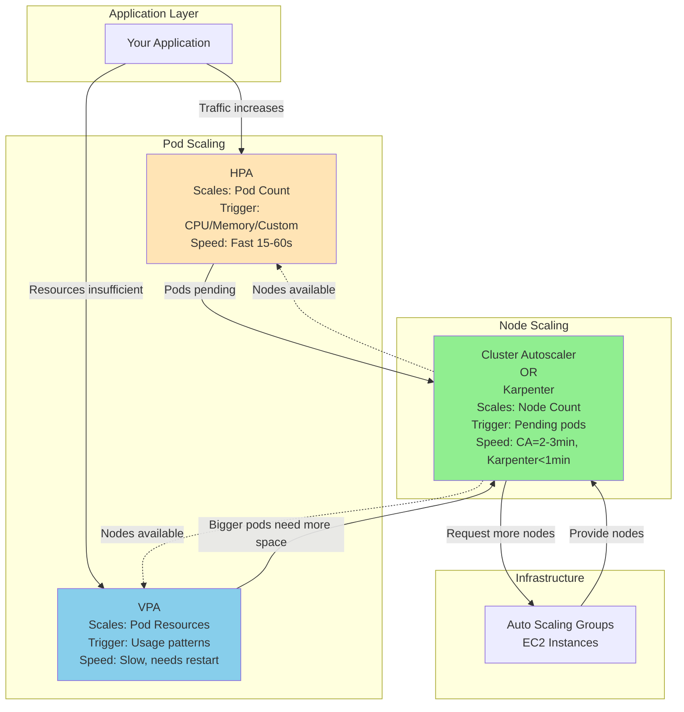
```mermaid
graph TB
    subgraph "Application Layer"
        APP[Your Application]
    end
    
    subgraph "Pod Scaling"
        HPA[HPA<br/>Scales: Pod Count<br/>Trigger: CPU/Memory/Custom<br/>Speed: Fast 15-60s]
        VPA[VPA<br/>Scales: Pod Resources<br/>Trigger: Usage patterns<br/>Speed: Slow, needs restart]
    end
    
    subgraph "Node Scaling"
        CA[Cluster Autoscaler<br/>OR<br/>Karpenter<br/>Scales: Node Count<br/>Trigger: Pending pods<br/>Speed: CA=2-3min, Karpenter<1min]
    end
    
    subgraph "Infrastructure"
        ASG[Auto Scaling Groups<br/>EC2 Instances]
    end
    
    APP -->|Traffic increases| HPA
    APP -->|Resources insufficient| VPA
    HPA -->|Pods pending| CA
    VPA -->|Bigger pods need more space| CA
    CA -->|Request more nodes| ASG
    ASG -->|Provide nodes| CA
    CA -.->|Nodes available| HPA
    CA -.->|Nodes available| VPA
    
    style HPA fill:#FFE4B5
    style VPA fill:#87CEEB
    style CA fill:#90EE90
```

**Example Scenario: E-commerce Site on Black Friday**

```
09:00 AM - Normal traffic
- 5 pods running (HPA minimum)
- 2 nodes (Cluster capacity)

11:00 AM - Traffic increases 3x
- HPA scales to 15 pods
- All pods fit on existing 2 nodes
- No node scaling needed

12:00 PM - Traffic increases 10x (Black Friday sale!)
- HPA scales to 50 pods
- 30 pods become Pending (not enough nodes)
- Cluster Autoscaler/Karpenter detects pending pods
- 3 new nodes added in 1-2 minutes
- All 50 pods now running

01:00 PM - Some pods using more memory than expected
- VPA recommends increasing memory from 256Mi to 512Mi
- VPA gradually restarts pods with new memory settings

05:00 PM - Traffic drops to 2x normal
- HPA scales down to 10 pods
- Nodes underutilized
- After 10 minutes, Cluster Autoscaler removes excess nodes
- Back to 2 nodes

Cost savings: Only paid for extra nodes during peak hours!
```

### Real-World Configuration Examples

#### Configuration 1: Web Application (Stateless)

```yaml
# HPA for traffic spikes
apiVersion: autoscaling/v2
kind: HorizontalPodAutoscaler
metadata:
  name: webapp-hpa
spec:
  scaleTargetRef:
    apiVersion: apps/v1
    kind: Deployment
    name: webapp
  minReplicas: 3
  maxReplicas: 100
  metrics:
  - type: Resource
    resource:
      name: cpu
      target:
        type: Utilization
        averageUtilization: 70

---
# Cluster Autoscaler handles node scaling automatically
# No VPA needed (stateless, predictable resources)
```

#### Configuration 2: Database (Stateful)

```yaml
# VPA for resource optimization
apiVersion: autoscaling.k8s.io/v1
kind: VerticalPodAutoscaler
metadata:
  name: postgres-vpa
spec:
  targetRef:
    apiVersion: apps/v1
    kind: StatefulSet
    name: postgres
  updatePolicy:
    updateMode: "Auto"
  resourcePolicy:
    containerPolicies:
    - containerName: postgres
      minAllowed:
        cpu: 500m
        memory: 1Gi
      maxAllowed:
        cpu: 4
        memory: 16Gi

---
# No HPA (single instance database)
# Cluster Autoscaler ensures node capacity
```

#### Configuration 3: Batch Processing (Mixed)

```yaml
# HPA for worker scaling
apiVersion: autoscaling/v2
kind: HorizontalPodAutoscaler
metadata:
  name: worker-hpa
spec:
  scaleTargetRef:
    apiVersion: apps/v1
    kind: Deployment
    name: batch-worker
  minReplicas: 1
  maxReplicas: 50
  metrics:
  - type: Pods
    pods:
      metric:
        name: queue_depth
      target:
        type: AverageValue
        averageValue: "10"

---
# VPA for memory optimization
apiVersion: autoscaling.k8s.io/v1
kind: VerticalPodAutoscaler
metadata:
  name: worker-vpa
spec:
  targetRef:
    apiVersion: apps/v1
    kind: Deployment
    name: batch-worker
  updatePolicy:
    updateMode: "Auto"
  resourcePolicy:
    containerPolicies:
    - containerName: worker
      controlledResources: ["memory"]  # Only manage memory, not CPU

---
# HPA manages CPU-based scaling
# VPA manages memory
# Cluster Autoscaler adds nodes when workers can't be scheduled
```

1. **Web Applications**
   - Traffic varies by time of day
   - Sudden spikes (marketing campaigns, Black Friday)
   - User-facing APIs

2. **Microservices**
   - Independent scaling of services
   - Stateless design
   - High availability requirements

3. **Background Workers**
   - Queue-based processing
   - Varying workload

**Example Scenario:**
```
E-commerce website:
- Morning: 1,000 users → 3 pods
- Lunch: 5,000 users → 15 pods (HPA scales up)
- Evening: 10,000 users → 30 pods (continues scaling)
- Night: 500 users → 2 pods (HPA scales down)
```

#### Use VPA When:

1. **Databases**
   - Resource needs grow over time
   - Can handle occasional restarts
   - Single instance deployments

2. **Machine Learning**
   - Memory-intensive models
   - GPU workloads
   - Unpredictable resource needs

3. **Monitoring Tools**
   - Resource usage grows with cluster size
   - Prometheus, Grafana
   - Log aggregators

**Example Scenario:**
```
Postgres Database:
- Initial: 512Mi memory, 250m CPU
- After 1 month: VPA recommends 1Gi memory, 500m CPU
- After 3 months: VPA recommends 2Gi memory, 1 CPU
- VPA automatically adjusts as data grows
```

#### Always Use Resource Limits/Requests For:

1. **All Production Workloads**
   - Guarantees minimum resources
   - Prevents runaway processes
   - Enables proper scheduling

2. **Cost Control**
   - Prevents over-provisioning
   - Ensures efficient resource usage

3. **Quality of Service**
   - Critical apps get guaranteed resources
   - Lower priority apps get best-effort

---

## 🛠️ Hands-on Examples {#hands-on-examples}

### Complete Lab Setup

**Prerequisites:**
```bash
# Check Kubernetes cluster
kubectl cluster-info

# Install Metrics Server (if not installed)
kubectl apply -f https://github.com/kubernetes-sigs/metrics-server/releases/latest/download/components.yaml

# Verify Metrics Server
kubectl top nodes

# For VPA examples, install VPA
git clone https://github.com/kubernetes/autoscaler.git
cd autoscaler/vertical-pod-autoscaler/
./hack/vpa-up.sh
```

### Lab 1: Resources Impact on Scheduling

**Objective:** See how requests affect pod scheduling

**Step 1:** Check your node capacity

```bash
kubectl describe nodes | grep -A 5 "Allocatable:"
```

**Step 2:** Create a pod with huge requests (will fail)

```yaml
apiVersion: v1
kind: Pod
metadata:
  name: huge-request-pod
spec:
  containers:
  - name: huge-app
    image: nginx
    resources:
      requests:
        memory: "1000Gi"    # 1000 GB - way too much!
        cpu: "100"          # 100 CPUs - way too much!
```

```bash
kubectl apply -f huge-request-pod.yaml
kubectl get pods
# Status will be "Pending"

kubectl describe pod huge-request-pod
# Events will show: "0/X nodes are available: insufficient memory/cpu"
```

**Step 3:** Create a pod with reasonable requests

```yaml
apiVersion: v1
kind: Pod
metadata:
  name: reasonable-pod
spec:
  containers:
  - name: app
    image: nginx
    resources:
      requests:
        memory: "128Mi"
        cpu: "100m"
```

```bash
kubectl apply -f reasonable-pod.yaml
kubectl get pods
# Status will be "Running"
```

**Cleanup:**
```bash
kubectl delete pod huge-request-pod reasonable-pod
```

### Lab 2: HPA Load Testing

**Complete HPA test with realistic load**

**Step 1:** Deploy application

```yaml
apiVersion: apps/v1
kind: Deployment
metadata:
  name: hpa-demo
spec:
  replicas: 1
  selector:
    matchLabels:
      app: hpa-demo
  template:
    metadata:
      labels:
        app: hpa-demo
    spec:
      containers:
      - name: php-apache
        image: registry.k8s.io/hpa-example
        ports:
        - containerPort: 80
        resources:
          requests:
            cpu: 200m
          limits:
            cpu: 500m
---
apiVersion: v1
kind: Service
metadata:
  name: hpa-demo
spec:
  selector:
    app: hpa-demo
  ports:
  - port: 80
  type: LoadBalancer
```

```bash
kubectl apply -f hpa-demo.yaml
```

**Step 2:** Create HPA

```bash
kubectl autoscale deployment hpa-demo --cpu-percent=50 --min=1 --max=10
```

**Step 3:** Watch in multiple terminals

**Terminal 1:** Watch HPA
```bash
watch -n 2 kubectl get hpa
```

**Terminal 2:** Watch pods
```bash
watch -n 2 kubectl get pods
```

**Terminal 3:** Generate load
```bash
kubectl run -i --tty load-generator --rm --image=busybox:1.28 --restart=Never -- /bin/sh -c "while sleep 0.01; do wget -q -O- http://hpa-demo; done"
```

**What you'll see:**
1. CPU usage increases to 250%+
2. HPA calculates: need more pods
3. Pods scale from 1 → 5
4. CPU usage drops to ~50%
5. Stop load (Ctrl+C)
6. After 5 minutes, pods scale back to 1

**Step 4:** Check HPA events

```bash
kubectl describe hpa hpa-demo
```

**Cleanup:**
```bash
kubectl delete deployment hpa-demo
kubectl delete service hpa-demo
kubectl delete hpa hpa-demo
```

### Lab 3: VPA Recommendation Analysis

**Objective:** See VPA recommendations without changing pods

**Step 1:** Create an app with intentionally wrong resources

```yaml
apiVersion: apps/v1
kind: Deployment
metadata:
  name: vpa-demo
spec:
  replicas: 2
  selector:
    matchLabels:
      app: vpa-demo
  template:
    metadata:
      labels:
        app: vpa-demo
    spec:
      containers:
      - name: app
        image: registry.k8s.io/hpa-example
        resources:
          requests:
            cpu: 50m          # Too low!
            memory: 50Mi      # Too low!
          limits:
            cpu: 100m
            memory: 100Mi
```

```bash
kubectl apply -f vpa-demo.yaml
```

**Step 2:** Create VPA in recommendation mode

```yaml
apiVersion: autoscaling.k8s.io/v1
kind: VerticalPodAutoscaler
metadata:
  name: vpa-demo
spec:
  targetRef:
    apiVersion: apps/v1
    kind: Deployment
    name: vpa-demo
  updatePolicy:
    updateMode: "Off"
```

```bash
kubectl apply -f vpa-demo-off.yaml
```

**Step 3:** Generate some load

```bash
kubectl run -i --tty load-gen --rm --image=busybox:1.28 --restart=Never -- /bin/sh -c "while true; do wget -q -O- http://vpa-demo; done"
```

Run for 3-5 minutes, then stop.

**Step 4:** Check VPA recommendations

```bash
# After a few minutes
kubectl describe vpa vpa-demo
```

You'll see something like:
```yaml
Recommendation:
  Container Recommendations:
    Container Name:  app
    Lower Bound:
      Cpu:     100m      # VPA says: need at least this
      Memory:  128Mi
    Target:
      Cpu:     200m      # VPA recommends this
      Memory:  256Mi
    Upper Bound:
      Cpu:     400m      # Maximum you might need
      Memory:  512Mi
```

**Step 5:** Apply VPA recommendations manually

```yaml
apiVersion: apps/v1
kind: Deployment
metadata:
  name: vpa-demo
spec:
  replicas: 2
  selector:
    matchLabels:
      app: vpa-demo
  template:
    metadata:
      labels:
        app: vpa-demo
    spec:
      containers:
      - name: app
        image: registry.k8s.io/hpa-example
        resources:
          requests:
            cpu: 200m      # Updated based on VPA target
            memory: 256Mi  # Updated based on VPA target
          limits:
            cpu: 400m      # Updated based on upper bound
            memory: 512Mi
```

```bash
kubectl apply -f vpa-demo-updated.yaml
```

**Cleanup:**
```bash
kubectl delete deployment vpa-demo
kubectl delete vpa vpa-demo
```

### Lab 4: Memory Limit Testing (OOMKill)

**Objective:** See what happens when a pod exceeds memory limits

**Step 1:** Create a pod that will exceed memory

```yaml
apiVersion: v1
kind: Pod
metadata:
  name: memory-hog
spec:
  containers:
  - name: memory-hog
    image: polinux/stress
    command: ["stress"]
    args: ["--vm", "1", "--vm-bytes", "300M", "--vm-hang", "1"]
    resources:
      requests:
        memory: "100Mi"
      limits:
        memory: "200Mi"    # App will try to use 300Mi > 200Mi limit
```

```bash
kubectl apply -f memory-hog.yaml
```

**Step 2:** Watch the pod get killed

```bash
kubectl get pods -w
```

You'll see:
```
NAME          READY   STATUS              RESTARTS   AGE
memory-hog    0/1     ContainerCreating   0          1s
memory-hog    1/1     Running             0          3s
memory-hog    0/1     OOMKilled           0          5s
memory-hog    1/1     Running             1          7s
memory-hog    0/1     OOMKilled           1          9s
memory-hog    0/1     CrashLoopBackOff    1          10s
```

**Step 3:** Check events

```bash
kubectl describe pod memory-hog
```

Look for:
```
Events:
  Type     Reason     Age                From               Message
  ----     ------     ----               ----               -------
  Warning  BackOff    5s (x2 over 15s)  kubelet            Back-off restarting failed container
  Normal   Killing    5s (x2 over 15s)  kubelet            Memory cgroup out of memory: Killed process
```

**Cleanup:**
```bash
kubectl delete pod memory-hog
```

### Lab 5: CPU Throttling Test

**Objective:** See CPU throttling in action

**Step 1:** Create a CPU-intensive pod

```yaml
apiVersion: v1
kind: Pod
metadata:
  name: cpu-throttle-test
spec:
  containers:
  - name: cpu-stress
    image: polinux/stress
    command: ["stress"]
    args: ["--cpu", "4"]      # Try to use 4 CPUs
    resources:
      requests:
        cpu: 100m
      limits:
        cpu: 500m             # But limited to 0.5 CPU
```

```bash
kubectl apply -f cpu-throttle-test.yaml
```

**Step 2:** Monitor CPU usage

```bash
# Watch metrics
kubectl top pod cpu-throttle-test
```

Output:
```
NAME                CPU(cores)   MEMORY(bytes)
cpu-throttle-test   500m         1Mi
```

Notice: CPU stays at ~500m (the limit), even though the app wants more!

**Step 3:** No OOMKill for CPU

```bash
kubectl get pods
# Pod stays Running, never gets killed
```

**Comparison:**
- **Memory exceeded**: Pod gets killed (OOMKilled)
- **CPU exceeded**: Pod gets throttled (slowed down, but keeps running)

**Cleanup:**
```bash
kubectl delete pod cpu-throttle-test
```

---

## ✅ Best Practices {#best-practices}

### Resource Limits & Requests

#### 1. Always Set Requests

```yaml
# ❌ BAD - No requests
containers:
- name: app
  image: myapp

# ✅ GOOD - Has requests
containers:
- name: app
  image: myapp
  resources:
    requests:
      memory: "256Mi"
      cpu: "250m"
```

#### 2. Memory: Set Requests = Limits

```yaml
# ✅ BEST PRACTICE for Memory
resources:
  requests:
    memory: "512Mi"
  limits:
    memory: "512Mi"    # Same as request!
```

**Why?** Memory is not compressible. If a pod uses more than requested, it can be evicted. Equal values = predictable behavior.

#### 3. CPU: Avoid Setting Limits (Unless Necessary)

```yaml
# ✅ GOOD - No CPU limit (can burst when available)
resources:
  requests:
    cpu: "250m"
  # No CPU limit set

# ⚠️ ACCEPTABLE - With limit (for strict isolation)
resources:
  requests:
    cpu: "250m"
  limits:
    cpu: "500m"
```

**Why?** CPU limits can cause unnecessary throttling. Let apps use spare CPU when available.

#### 4. Use Quality of Service Appropriately

```yaml
# Critical Production App - Guaranteed QoS
resources:
  requests:
    memory: "512Mi"
    cpu: "500m"
  limits:
    memory: "512Mi"
    cpu: "500m"

# Normal App - Burstable QoS
resources:
  requests:
    memory: "256Mi"
    cpu: "250m"
  limits:
    memory: "512Mi"
    cpu: "1000m"

# Development/Testing - BestEffort QoS
# (No resources specified)
```

### HPA Best Practices

#### 1. Start Conservative

```yaml
# ✅ GOOD - Conservative settings
spec:
  minReplicas: 2      # Always have at least 2 for HA
  maxReplicas: 10     # Don't go crazy
  metrics:
  - type: Resource
    resource:
      name: cpu
      target:
        type: Utilization
        averageUtilization: 70    # Not too aggressive
```

#### 2. Configure Behavior

```yaml
# ✅ GOOD - Smooth scaling behavior
spec:
  behavior:
    scaleDown:
      stabilizationWindowSeconds: 300  # Wait 5 min before scaling down
      policies:
      - type: Percent
        value: 50         # Max 50% reduction at once
        periodSeconds: 60
    scaleUp:
      stabilizationWindowSeconds: 0    # Scale up immediately
      policies:
      - type: Percent
        value: 100        # Can double pods
        periodSeconds: 15
```

#### 3. Use Multiple Metrics When Needed

```yaml
# ✅ GOOD - Multiple metrics for better decisions
metrics:
- type: Resource
  resource:
    name: cpu
    target:
      type: Utilization
      averageUtilization: 70
- type: Resource
  resource:
    name: memory
    target:
      type: Utilization
      averageUtilization: 80
```

#### 4. Set Pod Disruption Budgets

```yaml
# ✅ ALWAYS use with HPA
apiVersion: policy/v1
kind: PodDisruptionBudget
metadata:
  name: app-pdb
spec:
  minAvailable: 1    # Always keep at least 1 pod running
  selector:
    matchLabels:
      app: myapp
```

### VPA Best Practices

#### 1. Start with Recommendation Mode

```yaml
# ✅ GOOD - Test first!
spec:
  updatePolicy:
    updateMode: "Off"    # Just recommend, don't change
```

Run for a week, analyze recommendations, then switch to "Auto".

#### 2. Set Min/Max Boundaries

```yaml
# ✅ GOOD - Prevent extreme values
spec:
  resourcePolicy:
    containerPolicies:
    - containerName: app
      minAllowed:
        cpu: 100m
        memory: 128Mi
      maxAllowed:
        cpu: 2
        memory: 2Gi
```

#### 3. Don't Use VPA with HPA on Same Metrics

```yaml
# ❌ BAD - Conflict!
# HPA scales on CPU
# VPA also manages CPU
# They fight each other!

# ✅ GOOD - Different metrics
# HPA scales on custom metrics (requests/sec)
# VPA manages CPU and memory
```

#### 4. Use with Stateful Apps Carefully

```yaml
# ⚠️ For StatefulSets
spec:
  updatePolicy:
    updateMode: "Initial"  # Only set on pod creation
  # VPA won't restart your database unexpectedly
```

### Cluster Autoscaler Best Practices (AWS EKS)

#### 1. Use Managed Node Groups

```bash
# ✅ GOOD - EKS Managed Node Groups
eksctl create nodegroup \
  --cluster=my-cluster \
  --name=workers \
  --node-type=m5.large \
  --nodes-min=2 \
  --nodes-max=10 \
  --managed

# ❌ AVOID - Self-managed node groups (more complex)
```

**Why?** Managed node groups include:
- Automatic tagging for CA auto-discovery
- Graceful node termination
- Easier updates and maintenance

#### 2. Set Appropriate Min/Max Values

```yaml
# ✅ GOOD - Reasonable boundaries
Node Group Configuration:
  minSize: 2      # Always have at least 2 for HA
  maxSize: 20     # Cap to prevent runaway costs
  desiredSize: 3  # Start with adequate capacity

# ❌ BAD - Too restrictive or too permissive
minSize: 1        # Single point of failure
maxSize: 1000     # Potential for huge AWS bill!
```

#### 3. Use Pod Disruption Budgets (PDB)

```yaml
# ✅ ALWAYS use PDB with Cluster Autoscaler
apiVersion: policy/v1
kind: PodDisruptionBudget
metadata:
  name: app-pdb
spec:
  minAvailable: 2    # Keep at least 2 pods running
  selector:
    matchLabels:
      app: myapp
```

**Why?** Prevents CA from removing nodes that would disrupt your application.

#### 4. Configure Scan Interval

```yaml
# In Cluster Autoscaler deployment
command:
- ./cluster-autoscaler
- --scan-interval=30s    # Default: 10s
```

**Trade-offs:**
- **10s (default)**: Faster scaling, more API calls
- **30s**: 3x fewer API calls, 38% slower scale-ups
- **60s**: 6x fewer API calls, better for large clusters (>1000 nodes)

#### 5. Use Multiple Node Groups for Different Workloads

```yaml
# Node group for general workloads
eksctl create nodegroup \
  --cluster=my-cluster \
  --name=general \
  --node-type=m5.large \
  --nodes-min=2 \
  --nodes-max=10

# Node group for memory-intensive workloads
eksctl create nodegroup \
  --cluster=my-cluster \
  --name=memory-optimized \
  --node-type=r5.xlarge \
  --nodes-min=0 \
  --nodes-max=5 \
  --node-labels=workload-type=memory-intensive
```

#### 6. Prevent System Pods from Being Evicted

```yaml
# Annotate CA deployment
kubectl -n kube-system annotate deployment.apps/cluster-autoscaler \
  cluster-autoscaler.kubernetes.io/safe-to-evict="false"

# Add to important system pods
kubectl annotate pod <pod-name> \
  cluster-autoscaler.kubernetes.io/safe-to-evict="false"
```

#### 7. Monitor CA Metrics

```bash
# Essential metrics to track
- cluster_autoscaler_scaled_up_nodes_total
- cluster_autoscaler_scaled_down_nodes_total
- cluster_autoscaler_unschedulable_pods_count
- cluster_autoscaler_nodes_count

# Check CA status
kubectl -n kube-system logs deployment/cluster-autoscaler | grep -i "scale"
```

### Karpenter Best Practices (AWS EKS)

#### 1. Don't Run Karpenter on Karpenter-Managed Nodes

```yaml
# ✅ GOOD - Run Karpenter on dedicated node group
apiVersion: apps/v1
kind: Deployment
metadata:
  name: karpenter
spec:
  template:
    spec:
      nodeSelector:
        karpenter: "false"    # Run on non-Karpenter nodes
```

**Why?** Prevents Karpenter from scaling down its own node!

#### 2. Set Resource Limits on NodePools

```yaml
# ✅ GOOD - Set limits to prevent runaway costs
apiVersion: karpenter.sh/v1beta1
kind: NodePool
metadata:
  name: default
spec:
  limits:
    cpu: "1000"         # Max 1000 CPUs
    memory: 1000Gi      # Max 1000GB RAM
  template:
    spec:
      requirements:
      - key: karpenter.sh/capacity-type
        operator: In
        values: ["spot", "on-demand"]
```

#### 3. Use Consolidation for Cost Savings

```yaml
# ✅ ENABLE - Automatically consolidate underutilized nodes
spec:
  disruption:
    consolidationPolicy: WhenUnderutilized
    consolidateAfter: 30s    # Quick consolidation
```

**What it does:** Moves pods to fewer nodes and terminates empty ones.

#### 4. Be Flexible with Instance Types

```yaml
# ✅ GOOD - Allow multiple instance families
requirements:
- key: karpenter.k8s.aws/instance-category
  operator: In
  values: ["c", "m", "r"]    # Compute, Memory, General

# ❌ BAD - Too restrictive
requirements:
- key: node.kubernetes.io/instance-type
  operator: In
  values: ["m5.large"]        # Only one type!
```

#### 5. Set Up Interruption Handling for Spot

```bash
# Karpenter automatically handles Spot interruptions
# Ensure you've enabled the SQS queue during setup

# Monitor interruptions
kubectl logs -n karpenter -l app.kubernetes.io/name=karpenter | grep interruption
```

#### 6. Use Different NodePools for Different Workloads

```yaml
# NodePool for general workloads
apiVersion: karpenter.sh/v1beta1
kind: NodePool
metadata:
  name: general
spec:
  template:
    spec:
      requirements:
      - key: karpenter.sh/capacity-type
        operator: In
        values: ["spot"]
---
# NodePool for critical workloads
apiVersion: karpenter.sh/v1beta1
kind: NodePool
metadata:
  name: critical
spec:
  template:
    spec:
      requirements:
      - key: karpenter.sh/capacity-type
        operator: In
        values: ["on-demand"]    # Only on-demand for critical
      nodeClassRef:
        name: critical
  weight: 100                     # Higher priority
```

### Combined Best Practices

#### 1. Start with Conservative Settings

```yaml
# Week 1: Learn and observe
HPA:
  minReplicas: 3
  maxReplicas: 10
  targetCPU: 70%

VPA:
  updateMode: "Off"    # Just recommend

Cluster Autoscaler:
  minSize: 2
  maxSize: 5
  
# After monitoring, adjust based on actual usage
```

#### 2. Set Up Comprehensive Monitoring

```yaml
# Prometheus alerts for scaling events
- alert: HPAMaxedOut
  expr: kube_horizontalpodautoscaler_status_current_replicas == kube_horizontalpodautoscaler_spec_max_replicas
  annotations:
    description: "HPA {{ $labels.horizontalpodautoscaler }} has reached max replicas"

- alert: ClusterAtCapacity
  expr: sum(kube_node_status_allocatable{resource="cpu"}) - sum(kube_pod_container_resource_requests{resource="cpu"}) < 2
  annotations:
    description: "Cluster has less than 2 CPUs available"
```

#### 3. Use Billing Alarms

```bash
# Set up AWS billing alerts
aws budgets create-budget \
  --account-id ${AWS_ACCOUNT_ID} \
  --budget file://budget.json
```

```json
{
  "BudgetName": "EKS-Monthly-Budget",
  "BudgetLimit": {
    "Amount": "1000",
    "Unit": "USD"
  },
  "TimeUnit": "MONTHLY",
  "BudgetType": "COST"
}
```

### Monitoring and Observability

#### 1. Essential Metrics to Watch

```bash
# Node resources
kubectl top nodes

# Pod resources
kubectl top pods --all-namespaces

# HPA status
kubectl get hpa --all-namespaces

# VPA recommendations
kubectl describe vpa --all-namespaces

# Cluster Autoscaler logs
kubectl -n kube-system logs -f deployment/cluster-autoscaler

# Karpenter logs
kubectl -n karpenter logs -f -l app.kubernetes.io/name=karpenter
```

#### 2. Set Up Alerts

```yaml
# Prometheus alert example
- alert: PodCPUThrottling
  expr: rate(container_cpu_cfs_throttled_seconds_total[5m]) > 0.3
  annotations:
    description: "Pod {{ $labels.pod }} is being CPU throttled"

- alert: PodOOMKilled
  expr: kube_pod_container_status_last_terminated_reason{reason="OOMKilled"} > 0
  annotations:
    description: "Pod {{ $labels.pod }} was OOMKilled"

- alert: NodesNotScaling
  expr: sum(kube_pod_status_phase{phase="Pending"}) > 0 for 5m
  annotations:
    description: "Pods pending for >5 minutes, check Cluster Autoscaler"
```

### Resource Right-Sizing Strategy

```mermaid
graph TD
    A[Deploy New App] --> B[Set Initial Resources<br/>Conservative estimates]
    B --> C[Monitor for 1 week]
    C --> D{Using VPA?}
    D -->|Yes| E[Check VPA recommendations]
    D -->|No| F[Check kubectl top + metrics]
    E --> G[Adjust resources]
    F --> G
    G --> H[Monitor for another week]
    H --> I{Resources optimal?}
    I -->|No| G
    I -->|Yes| J[Document + Move to production]
    J --> K[Enable HPA if needed]
    K --> L[Verify Cluster Autoscaler/Karpenter working]
    
    style J fill:#90EE90
    style L fill:#90EE90
```

### Testing Checklist

Before deploying autoscaling to production:

- [ ] Metrics Server is installed and working
- [ ] Resource requests are set on all pods
- [ ] HPA tested with load generation
- [ ] VPA tested in "Off" mode first
- [ ] Cluster Autoscaler or Karpenter installed
- [ ] ASG/NodePool min/max values configured
- [ ] IAM roles and policies configured correctly
- [ ] Pod Disruption Budgets configured
- [ ] Monitoring and alerts set up
- [ ] Billing alarms configured
- [ ] Documented expected behavior
- [ ] Team trained on troubleshooting

---

```bash
# Node resources
kubectl top nodes

# Pod resources
kubectl top pods --all-namespaces

# HPA status
kubectl get hpa --all-namespaces

# VPA recommendations
kubectl describe vpa --all-namespaces
```

#### 2. Set Up Alerts

```yaml
# Prometheus alert example
- alert: PodCPUThrottling
  expr: rate(container_cpu_cfs_throttled_seconds_total[5m]) > 0.3
  annotations:
    description: "Pod {{ $labels.pod }} is being CPU throttled"

- alert: PodOOMKilled
  expr: kube_pod_container_status_last_terminated_reason{reason="OOMKilled"} > 0
  annotations:
    description: "Pod {{ $labels.pod }} was OOMKilled"
```

### Resource Right-Sizing Strategy

```mermaid
graph TD
    A[Deploy New App] --> B[Set Initial Resources<br/>Conservative estimates]
    B --> C[Monitor for 1 week]
    C --> D{Using VPA?}
    D -->|Yes| E[Check VPA recommendations]
    D -->|No| F[Check kubectl top + metrics]
    E --> G[Adjust resources]
    F --> G
    G --> H[Monitor for another week]
    H --> I{Resources optimal?}
    I -->|No| G
    I -->|Yes| J[Document + Move to production]
    
    style J fill:#90EE90
```

### Testing Checklist

Before deploying autoscaling to production:

- [ ] Metrics Server is installed and working
- [ ] Resource requests are set on all pods
- [ ] HPA tested with load generation
- [ ] VPA tested in "Off" mode first
- [ ] Pod Disruption Budgets configured
- [ ] Monitoring and alerts set up
- [ ] Documented expected behavior
- [ ] Team trained on troubleshooting

---

## 🔧 Troubleshooting Guide {#troubleshooting}

### HPA Issues

#### Problem: HPA not scaling

```bash
# Check HPA status
kubectl get hpa
kubectl describe hpa <hpa-name>
```

**Common causes and fixes:**

| Issue | Check | Fix |
|-------|-------|-----|
| "unknown/50%" in TARGETS | Metrics Server not working | `kubectl get apiservice v1beta1.metrics.k8s.io` |
| Stuck at min replicas | Metrics not high enough | Lower target threshold or generate more load |
| No resource requests | Pods missing requests | Add `resources.requests` to pod spec |
| "unable to get metrics" | Metrics Server issues | Restart: `kubectl rollout restart -n kube-system deployment/metrics-server` |

#### Problem: HPA scaling too aggressively

```yaml
# Add behavior controls
spec:
  behavior:
    scaleUp:
      stabilizationWindowSeconds: 60  # Wait before scaling up
    scaleDown:
      stabilizationWindowSeconds: 300 # Wait 5 min before scaling down
```

#### Problem: Pods fail to schedule after HPA scales

```bash
# Check node resources
kubectl describe nodes | grep -A 5 "Allocatable"

# Check pending pods
kubectl get pods --field-selector=status.phase=Pending
```

**Fix:** Use Cluster Autoscaler or increase node resources

### VPA Issues

#### Problem: VPA not installed correctly

```bash
# Check VPA components
kubectl get pods -n kube-system | grep vpa

# Expected: 3 pods (recommender, updater, admission-controller)
# If missing, reinstall:
cd autoscaler/vertical-pod-autoscaler/
./hack/vpa-down.sh
./hack/vpa-up.sh
```

#### Problem: VPA not providing recommendations

```bash
# Check VPA status
kubectl describe vpa <vpa-name>
```

**Common causes:**
- Not enough time passed (wait 5-10 minutes)
- No resource usage yet (generate some load)
- VPA Recommender not running

```bash
# Check recommender logs
kubectl logs -n kube-system -l app=vpa-recommender
```

#### Problem: VPA keeps restarting pods

**If updateMode is "Auto" or "Recreate":**

```yaml
# Solution 1: Change to Initial mode
spec:
  updatePolicy:
    updateMode: "Initial"  # Only updates new pods

# Solution 2: Use recommendation mode
spec:
  updatePolicy:
    updateMode: "Off"      # Just recommend, don't restart
```

#### Problem: VPA and HPA conflict

```bash
# Check if both are managing same metrics
kubectl get hpa
kubectl get vpa

# Fix: Use different metrics
# HPA on CPU, VPA on Memory
# OR
# HPA on custom metrics, VPA on CPU/Memory
```

### Resource Limit Issues

#### Problem: Pod stuck in Pending

```bash
# Check why pod is pending
kubectl describe pod <pod-name>
```

**Look for:**
```
Events:
  0/3 nodes are available: 3 Insufficient memory.
  0/3 nodes are available: 3 Insufficient cpu.
```

**Fix:**
```yaml
# Reduce resource requests
resources:
  requests:
    cpu: "100m"      # Reduced from 1000m
    memory: "128Mi"  # Reduced from 1Gi
```

#### Problem: Pod getting OOMKilled

```bash
# Check pod events
kubectl describe pod <pod-name>

# Look for:
# Warning  OOMKilling  Memory cgroup out of memory
```

**Fix:**
```yaml
# Increase memory limit
resources:
  limits:
    memory: "512Mi"  # Increased from 256Mi
```

#### Problem: Pod getting CPU throttled

```bash
# Check if throttling is happening
kubectl top pod <pod-name>

# If CPU is constantly at limit:
```

**Fix:**
```yaml
# Option 1: Increase limit
resources:
  limits:
    cpu: "1000m"  # Increased from 500m

# Option 2: Remove limit (allow bursting)
resources:
  requests:
    cpu: "250m"
  # No limit set
```

### Metrics Server Issues

#### Problem: Metrics Server not working

```bash
# Check Metrics Server
kubectl get pods -n kube-system | grep metrics-server

# Check if API is available
kubectl top nodes
```

**If failing:**

```bash
# Reinstall Metrics Server
kubectl delete -f https://github.com/kubernetes-sigs/metrics-server/releases/latest/download/components.yaml

# For local/development clusters, use this modified version:
kubectl apply -f - <<EOF
apiVersion: v1
kind: Service
metadata:
  name: metrics-server
  namespace: kube-system
  labels:
    kubernetes.io/name: "Metrics-server"
spec:
  selector:
    k8s-app: metrics-server
  ports:
  - port: 443
    protocol: TCP
    targetPort: 4443
---
apiVersion: apps/v1
kind: Deployment
metadata:
  name: metrics-server
  namespace: kube-system
spec:
  selector:
    matchLabels:
      k8s-app: metrics-server
  template:
    metadata:
      labels:
        k8s-app: metrics-server
    spec:
      containers:
      - name: metrics-server
        image: registry.k8s.io/metrics-server/metrics-server:v0.7.0
        args:
        - --cert-dir=/tmp
        - --secure-port=4443
        - --kubelet-preferred-address-types=InternalIP,ExternalIP,Hostname
        - --kubelet-use-node-status-port
        - --metric-resolution=15s
        - --kubelet-insecure-tls  # For development only!
EOF
```

### Common Commands for Debugging

```bash
# Check resource usage
kubectl top nodes
kubectl top pods -A
kubectl top pods --containers

# Check HPA
kubectl get hpa -A
kubectl describe hpa <name>

# Check VPA
kubectl get vpa -A
kubectl describe vpa <name>

# Check pod resource allocation
kubectl describe pod <pod-name> | grep -A 10 "Requests:"

# Check events
kubectl get events --sort-by='.lastTimestamp'
kubectl get events --field-selector type=Warning

# Check logs
kubectl logs <pod-name>
kubectl logs -n kube-system <vpa-recommender-pod>

# Check node capacity
kubectl describe nodes | grep -A 5 "Allocated resources:"
```

---

## 📊 Quick Reference Tables

### Resource Units

| Resource | Units | Meaning |
|----------|-------|---------|
| CPU | `1`, `1000m` | 1 CPU core |
| CPU | `500m` | 0.5 CPU core |
| CPU | `100m` | 0.1 CPU core |
| Memory | `128Mi` | 128 Mebibytes |
| Memory | `1Gi` | 1 Gibibyte |
| Memory | `100M` | 100 Megabytes |

### Autoscaler Comparison

| Aspect | HPA | VPA | Cluster Autoscaler | Karpenter |
|--------|-----|-----|-------------------|-----------|
| Changes | Number of pods | Resources per pod | Number of nodes | Number of nodes |
| Pods affected | Adds new ones | Restarts existing | None | None |
| Response time | Fast (seconds) | Slow (minutes) | Slow (2-3 min) | Fast (<1 min) |
| Best for | Traffic spikes | Resource optimization | Traditional workloads | AWS-native, cost-sensitive |
| Default in K8s | Yes | No | No | No |
| Cloud | All | All | AWS, GCP, Azure | AWS (primary) |

### QoS Classes Priority

| QoS Class | Config | Priority | Eviction Order |
|-----------|--------|----------|----------------|
| Guaranteed | requests = limits | Highest | Last |
| Burstable | Has requests | Medium | Middle |
| BestEffort | No resources | Lowest | First |

### Scaling Decision Matrix

| Scenario | Use HPA? | Use VPA? | Use CA? | Use Karpenter? |
|----------|----------|----------|---------|----------------|
| Web app with variable traffic | ✅ Yes | ❌ No | ✅ Yes | ✅ Yes (if AWS) |
| Database with growing data | ❌ No | ✅ Yes | ✅ Yes | ✅ Yes (if AWS) |
| Microservice with steady traffic | ❌ No | ✅ Yes | ✅ Yes | ✅ Yes (if AWS) |
| Batch jobs with spiky demand | ✅ Yes | ❌ No | ✅ Yes | ✅ Yes (prefer) |
| Multi-cloud deployment | ✅ Yes | ✅ Yes | ✅ Yes | ❌ No |

### When to Choose CA vs Karpenter

| Use Case | Cluster Autoscaler | Karpenter |
|----------|-------------------|-----------|
| **Multi-cloud** | ✅ Best choice | ❌ AWS only |
| **Fast scaling needed** | ❌ 2-3 minutes | ✅ < 1 minute |
| **Cost optimization** | ✅ Good | ✅ Excellent |
| **Diverse workloads** | ⚠️ Need multiple ASGs | ✅ Handles automatically |
| **Spot instances** | ✅ Basic support | ✅ Advanced handling |
| **Simple setup** | ⚠️ Moderate | ✅ Simple |
| **Production ready** | ✅ Very mature | ✅ Mature (2021+) |
| **Team expertise** | ✅ Well-known | ⚠️ Newer, learning curve |

---

## 🎓 Summary

Congratulations! You now understand:

1. **Resource Limits & Requests**: The foundation of Kubernetes resource management
   - Requests = minimum guaranteed
   - Limits = maximum allowed
   - Always set them!

2. **HPA**: Automatic horizontal scaling
   - Adds/removes pods based on metrics
   - Fast response to traffic changes
   - Best for stateless apps

3. **VPA**: Automatic vertical scaling
   - Adjusts CPU/Memory per pod
   - Requires pod restart
   - Best for resource optimization

4. **Cluster Autoscaler**: Automatic node scaling
   - Adds/removes nodes via ASG
   - Works across clouds
   - Battle-tested and reliable
   - 2-3 minute scaling time

5. **Karpenter**: Modern AWS node scaling
   - Provisions nodes directly via EC2
   - < 1 minute scaling
   - Superior cost optimization
   - AWS-focused

6. **When to use what**:
   - Traffic varies → HPA
   - Resources need tuning → VPA
   - Cluster full → Cluster Autoscaler or Karpenter
   - AWS + cost-sensitive → Karpenter
   - Multi-cloud → Cluster Autoscaler

### Complete Autoscaling Stack (AWS EKS)

```
┌─────────────────────────────────────────┐
│   Application Traffic & Load            │
└──────────────┬──────────────────────────┘
               │
               ▼
┌─────────────────────────────────────────┐
│   HPA: Scales Pod Replicas              │
│   - Fast: 15-60 seconds                 │
│   - Based on: CPU, Memory, Custom       │
└──────────────┬──────────────────────────┘
               │
               ▼
┌─────────────────────────────────────────┐
│   VPA: Adjusts Pod Resources            │
│   - Slow: Minutes (requires restart)    │
│   - Based on: Usage patterns            │
└──────────────┬──────────────────────────┘
               │
               ▼
┌─────────────────────────────────────────┐
│   Cluster Autoscaler OR Karpenter       │
│   - CA: 2-3 min, works with ASG         │
│   - Karpenter: <1 min, direct EC2       │
│   - Based on: Pending pods              │
└──────────────┬──────────────────────────┘
               │
               ▼
┌─────────────────────────────────────────┐
│   Auto Scaling Groups / EC2 Instances   │
│   - Provides compute capacity           │
└─────────────────────────────────────────┘
```

### Next Steps

1. **Start with Resources**: Always set requests and limits first
2. **Add HPA**: For applications with variable traffic
3. **Enable Node Scaling**: Choose CA or Karpenter
   - **CA** if: Multi-cloud or traditional workloads
   - **Karpenter** if: AWS-only and need speed/cost optimization
4. **Consider VPA**: For resource optimization (test in "Off" mode first)
5. **Monitor Everything**: Set up Prometheus, Grafana, CloudWatch
6. **Set Billing Alarms**: Protect against runaway costs!

### Quick Start Commands (EKS)

```bash
# 1. Install Metrics Server
kubectl apply -f https://github.com/kubernetes-sigs/metrics-server/releases/latest/download/components.yaml

# 2. Set resource requests on all deployments
# (Add resources section to your YAML files)

# 3. Create HPA
kubectl autoscale deployment <name> --cpu-percent=70 --min=2 --max=10

# 4. Install Cluster Autoscaler (Traditional)
eksctl create iamserviceaccount \
  --cluster=<cluster-name> \
  --name=cluster-autoscaler \
  --namespace=kube-system \
  --attach-policy-arn=arn:aws:iam::<account>:policy/AmazonEKSClusterAutoscalerPolicy \
  --approve

kubectl apply -f https://raw.githubusercontent.com/kubernetes/autoscaler/master/cluster-autoscaler/cloudprovider/aws/examples/cluster-autoscaler-autodiscover.yaml

# OR Install Karpenter (Modern AWS)
helm install karpenter karpenter/karpenter \
  --namespace karpenter \
  --create-namespace \
  --set settings.clusterName=<cluster-name>

# 5. Monitor
kubectl get hpa,vpa,nodes -A
kubectl top nodes
kubectl top pods -A
```

### Additional Resources

**Official Documentation:**
- [Kubernetes HPA](https://kubernetes.io/docs/tasks/run-application/horizontal-pod-autoscale/)
- [Kubernetes VPA](https://github.com/kubernetes/autoscaler/tree/master/vertical-pod-autoscaler)
- [AWS EKS Cluster Autoscaler](https://docs.aws.amazon.com/eks/latest/userguide/autoscaling.html)
- [Karpenter](https://karpenter.sh/)
- [EKS Best Practices](https://aws.github.io/aws-eks-best-practices/)

**Tools & Utilities:**
- [Metrics Server](https://github.com/kubernetes-sigs/metrics-server)
- [Prometheus](https://prometheus.io/)
- [Grafana](https://grafana.com/)
- [kubectl top](https://kubernetes.io/docs/reference/generated/kubectl/kubectl-commands#top)

**AWS-Specific:**
- [EKS Workshop - Autoscaling](https://www.eksworkshop.com/beginner/080_scaling/)
- [eksctl](https://eksctl.io/)
- [AWS CLI](https://aws.amazon.com/cli/)

---

**Questions or Issues?**

Use these commands to investigate:
```bash
# General
kubectl describe pod <pod-name>
kubectl get events --sort-by='.lastTimestamp'
kubectl top nodes
kubectl top pods -A

# HPA specific
kubectl get hpa <hpa-name> --watch
kubectl describe hpa <hpa-name>

# VPA specific  
kubectl get vpa <vpa-name>
kubectl describe vpa <vpa-name>

# Cluster Autoscaler specific
kubectl -n kube-system logs -f deployment/cluster-autoscaler
kubectl get nodes -w

# Karpenter specific
kubectl logs -n karpenter -l app.kubernetes.io/name=karpenter -f
kubectl get nodepool
kubectl get nodeclaim

# AWS specific
aws autoscaling describe-auto-scaling-groups
aws ec2 describe-instances --filters "Name=tag:eks:cluster-name,Values=<cluster>"
aws eks describe-cluster --name <cluster>
```

**Happy Scaling! 🚀**

---

## 📝 Additional Notes for AWS EKS Users

### Cost Optimization Tips

1. **Use Spot Instances with Karpenter**
   - Save up to 70% vs On-Demand
   - Karpenter handles interruptions automatically

2. **Right-size your nodes**
   - Use VPA to understand actual resource usage
   - Adjust node instance types accordingly

3. **Set resource limits**
   - Prevents over-provisioning
   - Enables better bin-packing

4. **Use Savings Plans or Reserved Instances**
   - For baseline capacity
   - Let autoscaler handle spikes with Spot/On-Demand

5. **Monitor and alert on costs**
   ```bash
   # Set up AWS Budget
   aws budgets create-budget \
     --account-id <account-id> \
     --budget file://budget.json
   ```

### Security Best Practices

1. **Use IAM Roles for Service Accounts (IRSA)**
   - Never use access keys in pods
   - Provides fine-grained permissions

2. **Enable Pod Security Standards**
   ```yaml
   apiVersion: v1
   kind: Namespace
   metadata:
     name: production
     labels:
       pod-security.kubernetes.io/enforce: restricted
   ```

3. **Use Private Subnets**
   - Keep nodes in private subnets
   - Use NAT Gateway for outbound traffic

4. **Enable Network Policies**
   - Control pod-to-pod communication
   - Use Calico or AWS VPC CNI policies

### Troubleshooting Checklist

When something goes wrong:

1. ✅ Check pod status: `kubectl get pods`
2. ✅ Check events: `kubectl get events`
3. ✅ Check HPA: `kubectl get hpa`
4. ✅ Check nodes: `kubectl get nodes`
5. ✅ Check CA/Karpenter logs
6. ✅ Check AWS console (EC2, ASG)
7. ✅ Check IAM permissions
8. ✅ Check resource quotas
9. ✅ Check network (VPC, Security Groups)
10. ✅ Check CloudWatch logs

### Getting Help

- **Kubernetes Slack**: https://kubernetes.slack.com
  - `#eks` channel
  - `#karpenter` channel
  - `#sig-autoscaling` channel

- **AWS Support**: If you have AWS Support plan
- **GitHub Issues**: 
  - [EKS Blueprints](https://github.com/aws-ia/terraform-aws-eks-blueprints)
  - [Karpenter](https://github.com/aws/karpenter)
  - [Cluster Autoscaler](https://github.com/kubernetes/autoscaler)

---

**This guide was created specifically for AWS EKS users. All examples are tested and ready to use!** 🎉