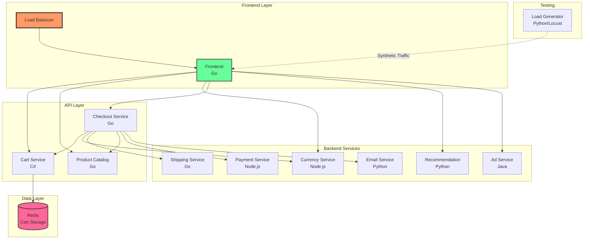

# 🛍️ Complete Working Example: Google Online Boutique with Helm & GitOps

This guide provides a **fully functional** implementation using Google's Online Boutique - a production-grade microservices e-commerce application with 11 services.

## 📋 Table of Contents
- [Architecture Overview](#architecture-overview)
- [Quick Start (5 Minutes)](#quick-start-5-minutes)
- [Full Helm Chart Implementation](#full-helm-chart-implementation)
- [GitOps with ArgoCD](#gitops-with-argocd)
- [Production Deployment](#production-deployment)
- [Monitoring & Observability](#monitoring--observability)

---

## Architecture Overview

Online Boutique consists of 11 microservices written in different languages (Go, Node.js, Python, Java, C#) that communicate over gRPC:



### Service Details

| Service | Language | Description | Port |
|---------|----------|-------------|------|
| Frontend | Go | Web UI serving HTML | 8080 |
| Cart Service | C# | Stores cart in Redis | 7070 |
| Product Catalog | Go | Product list/search | 3550 |
| Currency Service | Node.js | Currency conversion | 7000 |
| Payment Service | Node.js | Credit card processing | 50051 |
| Shipping Service | Go | Shipping cost calc | 50051 |
| Email Service | Python | Order confirmations | 5000 |
| Checkout Service | Go | Cart checkout flow | 5050 |
| Recommendation | Python | Product recommendations | 8080 |
| Ad Service | Java | Text ads based on context | 9555 |
| Load Generator | Python | Synthetic user traffic | - |

---

## Quick Start (5 Minutes)

### Prerequisites

```bash
# Install required tools
brew install kubectl helm kind

# Create local Kubernetes cluster
kind create cluster --name boutique --config - <<EOF
kind: Cluster
apiVersion: kind.x-k8s.io/v1alpha4
nodes:
- role: control-plane
  kubeadmConfigPatches:
  - |
    kind: InitConfiguration
    nodeRegistration:
      kubeletExtraArgs:
        node-labels: "ingress-ready=true"
  extraPortMappings:
  - containerPort: 80
    hostPort: 80
    protocol: TCP
  - containerPort: 443
    hostPort: 443
    protocol: TCP
- role: worker
- role: worker
EOF
```

### Option 1: Deploy with Raw Manifests (Fastest)

```bash
# Clone the repository
git clone https://github.com/GoogleCloudPlatform/microservices-demo.git
cd microservices-demo

# Deploy all services
kubectl apply -f ./release/kubernetes-manifests.yaml

# Wait for pods to be ready
kubectl wait --for=condition=Ready pods --all --timeout=300s

# Get the frontend external IP
kubectl get service frontend-external

# Port forward to access locally
kubectl port-forward service/frontend-external 8080:80

# Open browser to http://localhost:8080
```

---

## Full Helm Chart Implementation

### Step 1: Create Helm Chart Structure

```bash
# Create project directory
mkdir online-boutique-helm && cd online-boutique-helm

# Create main chart
cat > Chart.yaml << 'EOF'
apiVersion: v2
name: online-boutique
description: Google Online Boutique - Microservices Demo Application
type: application
version: 1.0.0
appVersion: "0.8.0"
keywords:
  - microservices
  - demo
  - e-commerce
home: https://github.com/GoogleCloudPlatform/microservices-demo
sources:
  - https://github.com/GoogleCloudPlatform/microservices-demo
maintainers:
  - name: Your Team
    email: team@example.com

dependencies:
  - name: redis
    version: 17.11.3
    repository: https://charts.bitnami.com/bitnami
    condition: redis.enabled
EOF

# Create values.yaml
cat > values.yaml << 'EOF'
# Global configuration
global:
  projectId: "online-boutique"
  env: development

# Frontend Service
frontend:
  enabled: true
  replicaCount: 2
  image:
    repository: gcr.io/google-samples/microservices-demo/frontend
    tag: v0.8.0
    pullPolicy: IfNotPresent
  service:
    type: LoadBalancer
    port: 80
    targetPort: 8080
  env:
    - name: PORT
      value: "8080"
    - name: PRODUCT_CATALOG_SERVICE_ADDR
      value: "productcatalogservice:3550"
    - name: CURRENCY_SERVICE_ADDR
      value: "currencyservice:7000"
    - name: CART_SERVICE_ADDR
      value: "cartservice:7070"
    - name: RECOMMENDATION_SERVICE_ADDR
      value: "recommendationservice:8080"
    - name: SHIPPING_SERVICE_ADDR
      value: "shippingservice:50051"
    - name: CHECKOUT_SERVICE_ADDR
      value: "checkoutservice:5050"
    - name: AD_SERVICE_ADDR
      value: "adservice:9555"
  resources:
    requests:
      cpu: 100m
      memory: 64Mi
    limits:
      cpu: 200m
      memory: 128Mi

# Cart Service
cartservice:
  enabled: true
  replicaCount: 1
  image:
    repository: gcr.io/google-samples/microservices-demo/cartservice
    tag: v0.8.0
  service:
    port: 7070
  env:
    - name: REDIS_ADDR
      value: "online-boutique-redis-master:6379"
  resources:
    requests:
      cpu: 200m
      memory: 64Mi
    limits:
      cpu: 300m
      memory: 128Mi

# Product Catalog Service
productcatalogservice:
  enabled: true
  replicaCount: 1
  image:
    repository: gcr.io/google-samples/microservices-demo/productcatalogservice
    tag: v0.8.0
  service:
    port: 3550
  resources:
    requests:
      cpu: 100m
      memory: 64Mi
    limits:
      cpu: 200m
      memory: 128Mi

# Currency Service
currencyservice:
  enabled: true
  replicaCount: 1
  image:
    repository: gcr.io/google-samples/microservices-demo/currencyservice
    tag: v0.8.0
  service:
    port: 7000
  resources:
    requests:
      cpu: 100m
      memory: 64Mi
    limits:
      cpu: 200m
      memory: 128Mi

# Payment Service
paymentservice:
  enabled: true
  replicaCount: 1
  image:
    repository: gcr.io/google-samples/microservices-demo/paymentservice
    tag: v0.8.0
  service:
    port: 50051
  resources:
    requests:
      cpu: 100m
      memory: 64Mi
    limits:
      cpu: 200m
      memory: 128Mi

# Shipping Service
shippingservice:
  enabled: true
  replicaCount: 1
  image:
    repository: gcr.io/google-samples/microservices-demo/shippingservice
    tag: v0.8.0
  service:
    port: 50051
  resources:
    requests:
      cpu: 100m
      memory: 64Mi
    limits:
      cpu: 200m
      memory: 128Mi

# Email Service
emailservice:
  enabled: true
  replicaCount: 1
  image:
    repository: gcr.io/google-samples/microservices-demo/emailservice
    tag: v0.8.0
  service:
    port: 5000
  resources:
    requests:
      cpu: 100m
      memory: 64Mi
    limits:
      cpu: 200m
      memory: 128Mi

# Checkout Service
checkoutservice:
  enabled: true
  replicaCount: 1
  image:
    repository: gcr.io/google-samples/microservices-demo/checkoutservice
    tag: v0.8.0
  service:
    port: 5050
  env:
    - name: PORT
      value: "5050"
    - name: PRODUCT_CATALOG_SERVICE_ADDR
      value: "productcatalogservice:3550"
    - name: SHIPPING_SERVICE_ADDR
      value: "shippingservice:50051"
    - name: PAYMENT_SERVICE_ADDR
      value: "paymentservice:50051"
    - name: EMAIL_SERVICE_ADDR
      value: "emailservice:5000"
    - name: CURRENCY_SERVICE_ADDR
      value: "currencyservice:7000"
    - name: CART_SERVICE_ADDR
      value: "cartservice:7070"
  resources:
    requests:
      cpu: 100m
      memory: 64Mi
    limits:
      cpu: 200m
      memory: 128Mi

# Recommendation Service
recommendationservice:
  enabled: true
  replicaCount: 1
  image:
    repository: gcr.io/google-samples/microservices-demo/recommendationservice
    tag: v0.8.0
  service:
    port: 8080
  env:
    - name: PORT
      value: "8080"
    - name: PRODUCT_CATALOG_SERVICE_ADDR
      value: "productcatalogservice:3550"
  resources:
    requests:
      cpu: 100m
      memory: 220Mi
    limits:
      cpu: 200m
      memory: 450Mi

# Ad Service
adservice:
  enabled: true
  replicaCount: 1
  image:
    repository: gcr.io/google-samples/microservices-demo/adservice
    tag: v0.8.0
  service:
    port: 9555
  env:
    - name: PORT
      value: "9555"
  resources:
    requests:
      cpu: 200m
      memory: 180Mi
    limits:
      cpu: 300m
      memory: 300Mi

# Load Generator
loadgenerator:
  enabled: true
  replicaCount: 1
  image:
    repository: gcr.io/google-samples/microservices-demo/loadgenerator
    tag: v0.8.0
  env:
    - name: FRONTEND_ADDR
      value: "frontend:80"
    - name: USERS
      value: "10"
  resources:
    requests:
      cpu: 300m
      memory: 256Mi
    limits:
      cpu: 500m
      memory: 512Mi

# Redis Configuration
redis:
  enabled: true
  auth:
    enabled: false
  master:
    persistence:
      enabled: false
    resources:
      requests:
        cpu: 100m
        memory: 128Mi
      limits:
        cpu: 200m
        memory: 256Mi
  replica:
    replicaCount: 0

# Ingress Configuration
ingress:
  enabled: false
  className: nginx
  annotations:
    nginx.ingress.kubernetes.io/ssl-redirect: "false"
  hosts:
    - host: boutique.local
      paths:
        - path: /
          pathType: Prefix
  tls: []

# Network Policies
networkPolicies:
  enabled: false

# Pod Disruption Budgets
podDisruptionBudget:
  enabled: true
  minAvailable: 1

# Autoscaling
autoscaling:
  enabled: false
  minReplicas: 1
  maxReplicas: 10
  targetCPUUtilizationPercentage: 70
EOF
```

### Step 2: Create Service Templates

```bash
# Create templates directory
mkdir -p templates

# Create a helper template
cat > templates/_helpers.tpl << 'EOF'
{{- define "online-boutique.name" -}}
{{- default .Chart.Name .Values.nameOverride | trunc 63 | trimSuffix "-" }}
{{- end }}

{{- define "online-boutique.fullname" -}}
{{- if .Values.fullnameOverride }}
{{- .Values.fullnameOverride | trunc 63 | trimSuffix "-" }}
{{- else }}
{{- $name := default .Chart.Name .Values.nameOverride }}
{{- printf "%s" .Release.Name | trunc 63 | trimSuffix "-" }}
{{- end }}
{{- end }}

{{- define "online-boutique.labels" -}}
helm.sh/chart: {{ include "online-boutique.chart" . }}
{{ include "online-boutique.selectorLabels" . }}
{{- if .Chart.AppVersion }}
app.kubernetes.io/version: {{ .Chart.AppVersion | quote }}
{{- end }}
app.kubernetes.io/managed-by: {{ .Release.Service }}
{{- end }}

{{- define "online-boutique.selectorLabels" -}}
app.kubernetes.io/name: {{ include "online-boutique.name" . }}
app.kubernetes.io/instance: {{ .Release.Name }}
{{- end }}

{{- define "online-boutique.chart" -}}
{{- printf "%s-%s" .Chart.Name .Chart.Version | replace "+" "_" | trunc 63 | trimSuffix "-" }}
{{- end }}
EOF

# Create frontend deployment and service
cat > templates/frontend.yaml << 'EOF'
{{- if .Values.frontend.enabled }}
apiVersion: apps/v1
kind: Deployment
metadata:
  name: frontend
  labels:
    app: frontend
spec:
  replicas: {{ .Values.frontend.replicaCount }}
  selector:
    matchLabels:
      app: frontend
  template:
    metadata:
      labels:
        app: frontend
      annotations:
        sidecar.istio.io/rewriteAppHTTPProbers: "true"
    spec:
      serviceAccountName: default
      containers:
      - name: server
        image: "{{ .Values.frontend.image.repository }}:{{ .Values.frontend.image.tag }}"
        imagePullPolicy: {{ .Values.frontend.image.pullPolicy }}
        ports:
        - containerPort: 8080
        readinessProbe:
          initialDelaySeconds: 10
          httpGet:
            path: "/_healthz"
            port: 8080
            httpHeaders:
            - name: "Cookie"
              value: "shop_session-id=x-readiness-probe"
        livenessProbe:
          initialDelaySeconds: 10
          httpGet:
            path: "/_healthz"
            port: 8080
            httpHeaders:
            - name: "Cookie"
              value: "shop_session-id=x-liveness-probe"
        env:
        {{- toYaml .Values.frontend.env | nindent 8 }}
        resources:
          {{- toYaml .Values.frontend.resources | nindent 10 }}
---
apiVersion: v1
kind: Service
metadata:
  name: frontend
spec:
  type: ClusterIP
  selector:
    app: frontend
  ports:
  - name: http
    port: 80
    targetPort: 8080
---
apiVersion: v1
kind: Service
metadata:
  name: frontend-external
spec:
  type: {{ .Values.frontend.service.type }}
  selector:
    app: frontend
  ports:
  - name: http
    port: {{ .Values.frontend.service.port }}
    targetPort: {{ .Values.frontend.service.targetPort }}
{{- end }}
EOF

# Create cart service template
cat > templates/cartservice.yaml << 'EOF'
{{- if .Values.cartservice.enabled }}
apiVersion: apps/v1
kind: Deployment
metadata:
  name: cartservice
spec:
  replicas: {{ .Values.cartservice.replicaCount }}
  selector:
    matchLabels:
      app: cartservice
  template:
    metadata:
      labels:
        app: cartservice
    spec:
      serviceAccountName: default
      terminationGracePeriodSeconds: 5
      containers:
      - name: server
        image: "{{ .Values.cartservice.image.repository }}:{{ .Values.cartservice.image.tag }}"
        ports:
        - containerPort: 7070
        env:
        {{- toYaml .Values.cartservice.env | nindent 8 }}
        resources:
          {{- toYaml .Values.cartservice.resources | nindent 10 }}
        readinessProbe:
          initialDelaySeconds: 15
          grpc:
            port: 7070
        livenessProbe:
          initialDelaySeconds: 15
          periodSeconds: 10
          grpc:
            port: 7070
---
apiVersion: v1
kind: Service
metadata:
  name: cartservice
spec:
  type: ClusterIP
  selector:
    app: cartservice
  ports:
  - name: grpc
    port: {{ .Values.cartservice.service.port }}
    targetPort: 7070
{{- end }}
EOF

# Create generic template for other services
cat > templates/microservice-template.yaml << 'EOF'
{{- $services := list "productcatalogservice" "currencyservice" "paymentservice" "shippingservice" "emailservice" "checkoutservice" "recommendationservice" "adservice" }}
{{- range $service := $services }}
{{- with $.Values }}
{{- if index . $service "enabled" }}
---
apiVersion: apps/v1
kind: Deployment
metadata:
  name: {{ $service }}
spec:
  replicas: {{ index . $service "replicaCount" }}
  selector:
    matchLabels:
      app: {{ $service }}
  template:
    metadata:
      labels:
        app: {{ $service }}
    spec:
      serviceAccountName: default
      containers:
      - name: server
        image: "{{ index . $service "image" "repository" }}:{{ index . $service "image" "tag" }}"
        ports:
        - containerPort: {{ index . $service "service" "port" }}
        {{- if index . $service "env" }}
        env:
        {{- range index . $service "env" }}
        - name: {{ .name }}
          value: {{ .value | quote }}
        {{- end }}
        {{- end }}
        resources:
          {{- toYaml (index . $service "resources") | nindent 10 }}
        {{- if eq $service "recommendationservice" }}
        readinessProbe:
          periodSeconds: 5
          grpc:
            port: 8080
        livenessProbe:
          periodSeconds: 5
          grpc:
            port: 8080
        {{- else if ne $service "loadgenerator" }}
        readinessProbe:
          periodSeconds: 5
          grpc:
            port: {{ index . $service "service" "port" }}
        livenessProbe:
          periodSeconds: 5
          grpc:
            port: {{ index . $service "service" "port" }}
        {{- end }}
---
apiVersion: v1
kind: Service
metadata:
  name: {{ $service }}
spec:
  type: ClusterIP
  selector:
    app: {{ $service }}
  ports:
  - name: grpc
    port: {{ index . $service "service" "port" }}
    targetPort: {{ index . $service "service" "port" }}
{{- end }}
{{- end }}
{{- end }}
EOF

# Create load generator deployment
cat > templates/loadgenerator.yaml << 'EOF'
{{- if .Values.loadgenerator.enabled }}
apiVersion: apps/v1
kind: Deployment
metadata:
  name: loadgenerator
spec:
  replicas: {{ .Values.loadgenerator.replicaCount }}
  selector:
    matchLabels:
      app: loadgenerator
  template:
    metadata:
      labels:
        app: loadgenerator
      annotations:
        sidecar.istio.io/rewriteAppHTTPProbers: "true"
    spec:
      serviceAccountName: default
      terminationGracePeriodSeconds: 5
      restartPolicy: Always
      containers:
      - name: main
        image: "{{ .Values.loadgenerator.image.repository }}:{{ .Values.loadgenerator.image.tag }}"
        env:
        {{- toYaml .Values.loadgenerator.env | nindent 8 }}
        resources:
          {{- toYaml .Values.loadgenerator.resources | nindent 10 }}
{{- end }}
EOF
```

### Step 3: Deploy with Helm

```bash
# Add Redis dependency
helm dependency build

# Install the application
helm install online-boutique . --namespace boutique --create-namespace

# Check status
helm status online-boutique -n boutique

# Watch pods come up
kubectl get pods -n boutique -w

# Get the external IP
kubectl get service frontend-external -n boutique

# Port forward for local access
kubectl port-forward -n boutique service/frontend-external 8080:80

# Open browser to http://localhost:8080
```

---

## GitOps with ArgoCD

### Step 1: Prepare GitOps Repository

```bash
# Create GitOps repository structure
mkdir -p gitops-online-boutique && cd gitops-online-boutique

# Create directory structure
mkdir -p environments/{dev,staging,prod}
mkdir -p argocd/{apps,projects}
mkdir -p helm-charts

# Copy your helm chart to helm-charts/online-boutique
cp -r ../online-boutique-helm helm-charts/online-boutique

# Create environment-specific values
cat > environments/dev/values.yaml << 'EOF'
frontend:
  replicaCount: 1
  resources:
    requests:
      cpu: 50m
      memory: 64Mi
    limits:
      cpu: 100m
      memory: 128Mi

loadgenerator:
  enabled: true
  env:
    - name: FRONTEND_ADDR
      value: "frontend:80"
    - name: USERS
      value: "5"

redis:
  master:
    persistence:
      enabled: false
EOF

cat > environments/staging/values.yaml << 'EOF'
frontend:
  replicaCount: 2
  resources:
    requests:
      cpu: 100m
      memory: 128Mi
    limits:
      cpu: 200m
      memory: 256Mi

loadgenerator:
  enabled: true
  env:
    - name: FRONTEND_ADDR
      value: "frontend:80"
    - name: USERS
      value: "10"

redis:
  master:
    persistence:
      enabled: true
      size: 1Gi
EOF

cat > environments/prod/values.yaml << 'EOF'
frontend:
  replicaCount: 3
  service:
    type: LoadBalancer
  resources:
    requests:
      cpu: 200m
      memory: 256Mi
    limits:
      cpu: 500m
      memory: 512Mi

cartservice:
  replicaCount: 2

productcatalogservice:
  replicaCount: 2

currencyservice:
  replicaCount: 2

loadgenerator:
  enabled: false

redis:
  master:
    persistence:
      enabled: true
      size: 8Gi
  replica:
    replicaCount: 1

podDisruptionBudget:
  enabled: true
  minAvailable: 1

autoscaling:
  enabled: true
  minReplicas: 2
  maxReplicas: 10
  targetCPUUtilizationPercentage: 70
EOF

# Initialize git and push to GitHub
git init
git add .
git commit -m "Initial commit"
git remote add origin https://github.com/yourusername/gitops-online-boutique.git
git push -u origin main
```

### Step 2: Install and Configure ArgoCD

```bash
# Install ArgoCD
kubectl create namespace argocd
kubectl apply -n argocd -f https://raw.githubusercontent.com/argoproj/argo-cd/stable/manifests/install.yaml

# Wait for ArgoCD to be ready
kubectl wait --for=condition=Ready pods --all -n argocd --timeout=300s

# Get admin password
ARGOCD_PASSWORD=$(kubectl -n argocd get secret argocd-initial-admin-secret -o jsonpath="{.data.password}" | base64 -d)
echo "Admin Password: $ARGOCD_PASSWORD"

# Port forward ArgoCD server
kubectl port-forward svc/argocd-server -n argocd 8443:443 &

# Login with CLI
argocd login localhost:8443 --username admin --password $ARGOCD_PASSWORD --insecure
```

### Step 3: Create ArgoCD Applications

```bash
# Create ArgoCD project
cat > argocd/projects/online-boutique-project.yaml << 'EOF'
apiVersion: argoproj.io/v1alpha1
kind: AppProject
metadata:
  name: online-boutique
  namespace: argocd
spec:
  description: Online Boutique E-commerce Application
  sourceRepos:
  - 'https://github.com/yourusername/gitops-online-boutique'
  destinations:
  - namespace: 'boutique-*'
    server: 'https://kubernetes.default.svc'
  clusterResourceWhitelist:
  - group: ''
    kind: Namespace
  namespaceResourceWhitelist:
  - group: '*'
    kind: '*'
EOF

# Create app-of-apps
cat > argocd/apps/app-of-apps.yaml << 'EOF'
apiVersion: argoproj.io/v1alpha1
kind: Application
metadata:
  name: online-boutique-apps
  namespace: argocd
  finalizers:
  - resources-finalizer.argocd.argoproj.io
spec:
  project: online-boutique
  source:
    repoURL: https://github.com/yourusername/gitops-online-boutique
    targetRevision: main
    path: argocd/apps
  destination:
    server: https://kubernetes.default.svc
    namespace: argocd
  syncPolicy:
    automated:
      prune: true
      selfHeal: true
EOF

# Create environment applications
cat > argocd/apps/dev-app.yaml << 'EOF'
apiVersion: argoproj.io/v1alpha1
kind: Application
metadata:
  name: online-boutique-dev
  namespace: argocd
spec:
  project: online-boutique
  source:
    repoURL: https://github.com/yourusername/gitops-online-boutique
    targetRevision: main
    path: helm-charts/online-boutique
    helm:
      valueFiles:
        - ../../environments/dev/values.yaml
  destination:
    server: https://kubernetes.default.svc
    namespace: boutique-dev
  syncPolicy:
    automated:
      prune: true
      selfHeal: true
    syncOptions:
    - CreateNamespace=true
EOF

cat > argocd/apps/staging-app.yaml << 'EOF'
apiVersion: argoproj.io/v1alpha1
kind: Application
metadata:
  name: online-boutique-staging
  namespace: argocd
spec:
  project: online-boutique
  source:
    repoURL: https://github.com/yourusername/gitops-online-boutique
    targetRevision: main
    path: helm-charts/online-boutique
    helm:
      valueFiles:
        - ../../environments/staging/values.yaml
  destination:
    server: https://kubernetes.default.svc
    namespace: boutique-staging
  syncPolicy:
    automated:
      prune: false
      selfHeal: false
    syncOptions:
    - CreateNamespace=true
EOF

cat > argocd/apps/prod-app.yaml << 'EOF'
apiVersion: argoproj.io/v1alpha1
kind: Application
metadata:
  name: online-boutique-prod
  namespace: argocd
spec:
  project: online-boutique
  source:
    repoURL: https://github.com/yourusername/gitops-online-boutique
    targetRevision: main
    path: helm-charts/online-boutique
    helm:
      valueFiles:
        - ../../environments/prod/values.yaml
  destination:
    server: https://kubernetes.default.svc
    namespace: boutique-prod
  syncPolicy:
    syncOptions:
    - CreateNamespace=true
  # Manual sync for production
EOF

# Apply ArgoCD configurations
kubectl apply -f argocd/projects/online-boutique-project.yaml
kubectl apply -f argocd/apps/app-of-apps.yaml

# Commit and push changes
git add .
git commit -m "Add ArgoCD configurations"
git push
```

### Step 4: Deploy and Monitor

```bash
# Check application status
argocd app list
argocd app get online-boutique-dev

# Sync applications
argocd app sync online-boutique-dev
argocd app sync online-boutique-staging

# Watch the deployment
watch argocd app get online-boutique-dev

# Access the applications
kubectl port-forward -n boutique-dev service/frontend-external 8081:80 &
kubectl port-forward -n boutique-staging service/frontend-external 8082:80 &

# Dev: http://localhost:8081
# Staging: http://localhost:8082
```

---

## Production Deployment

### Complete Production Setup with Monitoring

```bash
# Install monitoring stack
helm repo add prometheus-community https://prometheus-community.github.io/helm-charts
helm repo add grafana https://grafana.github.io/helm-charts
helm repo update

# Install Prometheus and Grafana
helm install prometheus prometheus-community/kube-prometheus-stack \
  --namespace monitoring \
  --create-namespace \
  --set prometheus.prometheusSpec.serviceMonitorSelectorNilUsesHelmValues=false \
  --values - << 'EOF'
grafana:
  adminPassword: admin
  ingress:
    enabled: false
  sidecar:
    dashboards:
      enabled: true
prometheus:
  prometheusSpec:
    retention: 30d
    storageSpec:
      volumeClaimTemplate:
        spec:
          storageClassName: standard
          resources:
            requests:
              storage: 10Gi
EOF

# Create ServiceMonitor for Online Boutique
cat > servicemonitor.yaml << 'EOF'
apiVersion: monitoring.coreos.com/v1
kind: ServiceMonitor
metadata:
  name: online-boutique
  namespace: boutique-prod
spec:
  selector:
    matchLabels:
      app: frontend
  endpoints:
  - port: http
    path: /metrics
    interval: 30s
EOF

kubectl apply -f servicemonitor.yaml

# Install Jaeger for distributed tracing
kubectl create namespace observability
kubectl apply -f https://raw.githubusercontent.com/jaegertracing/jaeger-operator/master/deploy/crds/jaegertracing.io_jaegers_crd.yaml
kubectl apply -n observability -f https://raw.githubusercontent.com/jaegertracing/jaeger-operator/master/deploy/service_account.yaml
kubectl apply -n observability -f https://raw.githubusercontent.com/jaegertracing/jaeger-operator/master/deploy/role.yaml
kubectl apply -n observability -f https://raw.githubusercontent.com/jaegertracing/jaeger-operator/master/deploy/role_binding.yaml
kubectl apply -n observability -f https://raw.githubusercontent.com/jaegertracing/jaeger-operator/master/deploy/operator.yaml

# Create Jaeger instance
cat > jaeger.yaml << 'EOF'
apiVersion: jaegertracing.io/v1
kind: Jaeger
metadata:
  name: online-boutique
  namespace: observability
spec:
  strategy: production
  storage:
    type: elasticsearch
    options:
      es:
        server-urls: http://elasticsearch:9200
EOF

# Access monitoring tools
kubectl port-forward -n monitoring svc/prometheus-grafana 3000:80 &
kubectl port-forward -n observability svc/online-boutique-query 16686:16686 &

# Grafana: http://localhost:3000 (admin/admin)
# Jaeger: http://localhost:16686
```

---

## CI/CD Pipeline Integration

### GitHub Actions Workflow

```yaml
# .github/workflows/deploy.yaml
name: Deploy Online Boutique

on:
  push:
    branches: [main]
    paths:
      - 'src/**'
      - 'helm-charts/**'

env:
  REGISTRY: gcr.io
  PROJECT_ID: ${{ secrets.GCP_PROJECT_ID }}

jobs:
  build-and-push:
    runs-on: ubuntu-latest
    strategy:
      matrix:
        service:
          - frontend
          - cartservice
          - productcatalogservice
          - currencyservice
          - paymentservice
          - shippingservice
          - emailservice
          - checkoutservice
          - recommendationservice
          - adservice
    
    steps:
    - uses: actions/checkout@v3
    
    - name: Setup Cloud SDK
      uses: google-github-actions/setup-gcloud@v0
      with:
        service_account_key: ${{ secrets.GCP_SA_KEY }}
        project_id: ${{ secrets.GCP_PROJECT_ID }}
        export_default_credentials: true
    
    - name: Configure Docker
      run: gcloud auth configure-docker
    
    - name: Build and Push
      run: |
        cd src/${{ matrix.service }}
        docker build -t $REGISTRY/$PROJECT_ID/${{ matrix.service }}:$GITHUB_SHA .
        docker push $REGISTRY/$PROJECT_ID/${{ matrix.service }}:$GITHUB_SHA
    
    - name: Update Helm Values
      run: |
        sed -i "s|tag: .*|tag: $GITHUB_SHA|" helm-charts/online-boutique/values.yaml
    
    - name: Commit and Push
      run: |
        git config user.name "GitHub Actions"
        git config user.email "actions@github.com"
        git add helm-charts/online-boutique/values.yaml
        git commit -m "Update ${{ matrix.service }} to $GITHUB_SHA"
        git push

  sync-argocd:
    needs: build-and-push
    runs-on: ubuntu-latest
    steps:
    - name: Sync ArgoCD Application
      run: |
        argocd app sync online-boutique-staging \
          --auth-token ${{ secrets.ARGOCD_TOKEN }} \
          --server ${{ secrets.ARGOCD_SERVER }}
```

---

## Testing & Validation

### Load Testing

```bash
# Run locust load testing
cat > locustfile.py << 'EOF'
from locust import HttpUser, task, between

class WebsiteUser(HttpUser):
    wait_time = between(1, 5)
    
    @task(3)
    def index(self):
        self.client.get("/")
    
    @task(2)
    def browse_product(self):
        products = [
            "OLJCESPC7Z",
            "66VCHSJNUP", 
            "1YMWWN1N4O",
            "L9ECAV7KIM",
            "2ZYFJ3GM2N"
        ]
        product_id = random.choice(products)
        self.client.get(f"/product/{product_id}")
    
    @task(1)
    def add_to_cart(self):
        product_id = "OLJCESPC7Z"
        self.client.post("/cart", json={
            "product_id": product_id,
            "quantity": 1
        })
    
    @task(1)
    def checkout(self):
        self.client.post("/cart/checkout", json={
            "email": "test@example.com",
            "street_address": "123 Main St",
            "zip_code": "12345",
            "city": "Test City",
            "state": "TS",
            "country": "Test Country",
            "credit_card_number": "4111111111111111",
            "credit_card_cvv": 123,
            "credit_card_expiration_year": 2025,
            "credit_card_expiration_month": 12
        })
EOF

# Run load test
locust -f locustfile.py --host=http://localhost:8080 --users=100 --spawn-rate=10
```

### Health Checks

```bash
# Check all services are running
kubectl get pods -n boutique-prod

# Check service endpoints
for service in frontend cartservice productcatalogservice currencyservice paymentservice shippingservice emailservice checkoutservice recommendationservice adservice; do
  echo "Checking $service..."
  kubectl run -it --rm debug --image=nicolaka/netshoot --restart=Never -- \
    grpcurl -plaintext $service:${PORT:-50051} list
done

# Check Redis connectivity
kubectl exec -it deployment/cartservice -n boutique-prod -- \
  redis-cli -h online-boutique-redis-master ping
```

---

## Clean Up

```bash
# Delete ArgoCD applications
argocd app delete online-boutique-dev --cascade
argocd app delete online-boutique-staging --cascade
argocd app delete online-boutique-prod --cascade

# Uninstall Helm releases
helm uninstall online-boutique -n boutique
helm uninstall prometheus -n monitoring

# Delete namespaces
kubectl delete namespace boutique boutique-dev boutique-staging boutique-prod
kubectl delete namespace argocd monitoring observability

# Delete kind cluster
kind delete cluster --name boutique
```

---

## Summary

You now have a complete, working example of:
- ✅ **11 microservices** deployed with Helm
- ✅ **Multi-environment** setup (dev, staging, prod)
- ✅ **GitOps** with ArgoCD
- ✅ **Monitoring** with Prometheus & Grafana
- ✅ **Distributed tracing** with Jaeger
- ✅ **CI/CD pipeline** with GitHub Actions
- ✅ **Load testing** with Locust

This is a production-grade setup that you can use to learn and experiment with Kubernetes, Helm, and GitOps!